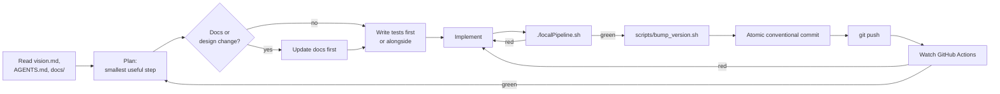

# AGENTS.md — how AI agents work in this repository

This file is the operating manual for any AI coding agent (Claude Code, Codex, Copilot
agents, …) and for humans who review agent work. It is binding: when a task description
conflicts with it, stop and ask the maintainer instead of silently picking one.

Project goal in one sentence: a genuine decoder-only transformer language model, designed
and trained by us, that runs fully locally on a single ESP32-S3 and becomes a useful
narrow-domain conversational/diagnostic assistant. The long form is [`vision.md`](vision.md);
the feasibility study and plans live in [`docs/`](docs/README.md).

---

## 1. Agent loop

Every non-trivial task follows the same loop. Skipping a step is a defect.



1. **Orient.** Read `vision.md`, this file, and the relevant page in `docs/` before touching
   code. Check `git log` for what already exists.
2. **Plan the smallest useful step.** One commit should do one thing that can be explained
   in one conventional-commit subject line.
3. **Docs first for design decisions.** If a step changes architecture, file formats,
   memory placement, the model, the dataset, or the public CLI/serial protocol, update
   the matching document in `docs/` in the same commit or before it.
4. **Tests with the code.** New behaviour ships with unit tests; cross-language behaviour
   (Python ↔ C ↔ firmware) ships with an integration test; user-visible flows ship with an
   end-to-end test.
5. **Run the full local pipeline** (`./localPipeline.sh`). Never commit red.
6. **Bump the version, commit, push**, then confirm GitHub Actions is green.

## 2. Non-negotiable rules

### 2.1 Respect other people's work — attribute, link, check licenses

We do not start from scratch when good prior art exists, and we never rip anybody off.

- Before reusing **code, weights, datasets, or tokenizer files**, check the upstream
  license. Record the decision in [`THIRD_PARTY_NOTICES.md`](THIRD_PARTY_NOTICES.md)
  (what, where from, commit/version, license, how we use it).
- **No license file = all rights reserved.** Such repositories may be *read, linked,
  cited, and benchmarked against* but their code must not be copied or adapted.
  (At the time of writing this applies to e.g. `DaveBben/esp32-llm`, `doryiii/esp32-llm`
  and `Circuit-Digest/ESP32-Tiny-LLM` — see `docs/07-prior-art.md`.)
- Permissive code (MIT, Apache-2.0, BSD) may be vendored or adapted if its notice is kept
  verbatim in the file header and in `THIRD_PARTY_NOTICES.md`. It is compatible with our
  GPLv3-or-later distribution.
- When an idea (not code) comes from a paper, blog, or repository, cite it with a link in
  the relevant doc and, where useful, in a code comment.
- Teacher-model outputs used as training data must come from a model whose terms allow
  it. Record teacher name, version, and terms in the dataset manifest. See
  `docs/04-distillation.md` §License matrix.

### 2.2 Firmware is the authority, the model only proposes

The language model never writes GPIOs, never bypasses validation, and never owns safety
decisions. Model output is parsed by a strict deterministic parser and validated by
firmware rules (ranges, interlocks, rate limits) before anything happens. Any change that
weakens this boundary is rejected regardless of test results.

### 2.3 Honest numbers

- Every performance or quality number in docs, README, or commit messages is labelled as
  **measured** (with board, config, firmware hash) or **estimated** (with the formula or
  source). No board is attached yet; until one is, on-device figures are estimates.
- Do not tune a test threshold to make a failing run pass. Fix the cause or document the
  regression and ask.

### 2.4 Git hygiene

- Work directly on `main` (maintainer decision). Never force-push, never rewrite pushed
  history, never skip hooks (`--no-verify`).
- **Atomic commits:** one logical change per commit; the tree builds and the pipeline is
  green at every commit.
- **Conventional Commits:** `type(scope): subject` with types `feat`, `fix`, `docs`,
  `test`, `refactor`, `perf`, `build`, `ci`, `chore`. Scopes in use: `runtime`,
  `training`, `firmware`, `web`, `tools`, `docs`, `ci`, `docker`, `model`, `data`.
- **SemVer in `VERSION`:** every commit bumps at least the patch number; a commit that
  completes a major feature/milestone bumps the minor number (patch resets to 0). Use
  `scripts/bump_version.sh patch|minor`. Pre-1.0 while the vision is being realised.
- Push after every green commit. If CI goes red, the next commit fixes it — nothing else
  lands on top of a red build.

### 2.5 Quality gates

- `./localPipeline.sh` is the single source of truth. GitHub Actions runs the same script
  (plus Docker publish); if you add a check, add it to the script, not only to CI.
- Line coverage ≥ 95 % for Python and for the host C runtime. Coverage exclusions need a
  one-line justification comment.
- Formatting (ruff format, clang-format), linting (ruff, clang-tidy/cppcheck,
  markdownlint), and type checks (mypy strict) are errors, not warnings.
- Mermaid diagrams in docs must render (the pipeline renders them).

### 2.6 Licensing headers

The project is **GPL-3.0-or-later**. Every source file we author (`.py`, `.c`, `.h`,
`.sh`, `.ts`, `.js`, `.css`, CMake, Dockerfile) starts with an SPDX header:

```text
SPDX-License-Identifier: GPL-3.0-or-later
Copyright (C) 2026 Marcel Petrick <mail@marcelpetrick.it>
```

`scripts/check_headers.sh` enforces this. Third-party files keep their original headers.

## 3. Repository map

| Path | Purpose |
|---|---|
| `vision.md` | original project vision (read-only reference; changes need the maintainer) |
| `docs/` | feasibility study, research angles, architecture, implementation plan |
| `training/` | Python: tokenizer, datasets, PyTorch model, training, export, quantization, eval |
| `runtime/` | portable C99 inference runtime (`tinyllm`) + host CLI + C unit tests |
| `firmware/` | ESP-IDF project that links the same runtime as a component |
| `web/` | host simulator: HTTP server + browser UI driving the C runtime |
| `tools/` | model packing/inspection, serial runner, benchmark harness |
| `scripts/` | small documented helpers used by humans, agents and CI |
| `tests/` | cross-component integration and end-to-end tests |
| `models/` | small committed reference models used by tests and the demo |

## 4. Where agents usually go wrong here

- **Framework creep.** Do not wrap the transformer in TFLM/ESP-DL/ONNX to call one fast
  kernel. Use ESP-DSP/ESP-NN at the kernel level only (vision §12).
- **Heap in the hot path.** After model initialisation the token loop must not allocate.
  Tests assert this on the host build.
- **Watchdog "fixes".** Never disable the task watchdog globally to hide a long loop; yield
  at layer boundaries or configure the inference task deliberately.
- **Python/C drift.** Any change to the binary format bumps its version and updates
  `training/export`, `runtime/src/model_loader.c`, `docs/05-architecture.md`, and the
  golden-file tests together.
- **Vocabulary size.** The output head dominates small models. Don't grow the vocabulary
  without a measured reason.
- **Claiming on-device results without hardware.** See §2.3.

## 5. Scripts

All scripts live in `scripts/`, start with a usage block, support `-h/--help`, and are
listed with a one-line description in [`scripts/README.md`](scripts/README.md). Prefer
adding a small script over repeating a multi-step shell incantation in docs or CI.

## 6. When to stop and ask the maintainer

- A license is unclear or restrictive for something we want to reuse.
- A requirement in `vision.md` looks impossible or contradictory after measurement.
- A change would weaken the firmware-authority boundary or safety interlocks.
- Anything destructive: deleting history, deleting published images/releases, rotating
  secrets, changing repository visibility.
- Hardware is needed (flashing, HIL benchmarks) and no board is attached.

Everything else: make a reasonable decision, document it in the relevant doc (an ADR-style
"Decision / Why / Alternatives" block is enough), and keep going.
