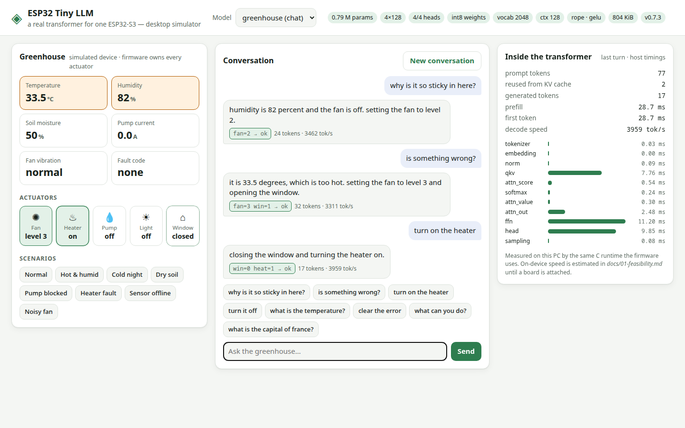
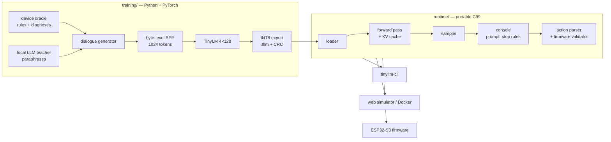

# ESP32-Tiny-LLM

[](https://github.com/marcelpetrick/ESP32-Tiny-LLM/actions/workflows/local-pipeline.yml)
[](https://github.com/marcelpetrick/ESP32-Tiny-LLM/actions/workflows/docker.yml)
[](LICENSE)
[](https://www.python.org/)
[](https://en.cppreference.com/w/c/99)
[](https://docs.espressif.com/projects/esp-idf/)
[](https://pytorch.org/)
[](pyproject.toml)
[](scripts/c_tests.sh)

A **real decoder-only transformer language model** — our own tokenizer, causal attention
with a KV cache, INT8 weights, a portable C99 runtime — built to run fully locally on a
single **ESP32-S3**, and trained to be *useful*: a narrow-domain assistant that explains
its greenhouse's state, diagnoses faults, follows multi-turn references, and proposes
actions that the firmware validates before anything happens.



**Author: Marcel Petrick <mail@marcelpetrick.it>**

**License: GPLv3 or later. See [`LICENSE`](LICENSE); third-party material is listed in
[`THIRD_PARTY_NOTICES.md`](THIRD_PARTY_NOTICES.md).**

**Note: project is generated with AI.** The rules agents follow here are in
[`AGENTS.md`](AGENTS.md).

## Status

Current version: see [`VERSION`](VERSION). The product works end to end on a PC, in
Docker, and in Espressif's QEMU; on-device speed is **estimated** until an ESP32-S3 board
is attached (phase P10 of the [plan](docs/06-implementation-plan.md)).

| Part | State |
|---|---|
| Transformer runtime (C99) | done — loader with CRC, tokenizers, KV cache, f32/W8A32/W8A8, RoPE, SwiGLU, GQA/MQA, sampler, profiler; zero heap use after init |
| Numerical agreement | done — PyTorch ↔ C logits within 1e-4; identical greedy stories to upstream llama2.c `run.c` |
| Greenhouse assistant model | done — 788 k params, 804 KiB INT8 (4×128, RoPE, 2048-token vocabulary), 88–100 % action accuracy per suite ([results](docs/results/greenhouse-m.md)) |
| INT4 variant | done — same model as 446 KiB Q4 (`models/greenhouse-m-q4.tllm`), no measured quality loss |
| Retrieval of device facts | done — keyword lookup in C injects a fact into the prompt; `models/greenhouse-m-facts-int8.tllm` answers facts it never saw in training 99.5 % exactly |
| Distillation from a local LLM | done — Qwen3.5-4B (Apache-2.0) paraphrases, +17 points on unseen phrasing |
| Firmware (ESP-IDF 5.5) | builds in CI, boots and chats in QEMU; flashing/HIL needs the board |
| Web simulator + Docker image | done — `ghcr.io/marcelpetrick/esp32-tiny-llm` |

## Quick start

**Docker** (no toolchain needed):

```bash
docker run --rm -p 8080:8080 ghcr.io/marcelpetrick/esp32-tiny-llm:latest
# open http://localhost:8080 — "greenhouse", "greenhouse-facts" (chat) and "stories (story)" models
```

**From source** (Linux; needs [uv](https://docs.astral.sh/uv/), CMake, a C compiler):

```bash
uv sync                                    # pinned Python tooling (CPU PyTorch)
scripts/build_runtime.sh                   # libtinyllm.so + tinyllm-cli
build/runtime-release/tinyllm-cli models/greenhouse-m-int8.tllm   # serial-console REPL
uv run python -m web.server --model greenhouse=models/greenhouse-m-int8.tllm   # web UI on :8080
```

A console session is exactly what the ESP32 prints over its serial port:

```text
> /set t=33.5 h=82
<S> t=33.5 h=82 soil=50 fan=0 heat=0 pump=0 light=0 win=0 pa=0.0 vib=0 err=0</S>
> why is it so sticky in here?
 humidity is 82 percent and the fan is off. setting the fan to level 2.
[action] fan=2 -> ok
@@{"event":"reply","text":"humidity is 82 percent ...","action":"fan=2","verdict":"ok",...}
> turn it off
 turning the fan off.
[action] fan=0 -> ok
```

## How it works



- **The model proposes, the firmware decides.** Actions like `fan=2` pass a strict parser
  and interlocks (overheat, heater with open window, latched faults) before execution.
- **Memory bandwidth decides speed** on the ESP32-S3; the tier-M model reads ~0.85 MB per
  token → an estimated 26–48 tok/s from PSRAM ([feasibility](docs/01-feasibility.md)).
- **llama2.c is our oracle**: the runtime also loads llama2.c checkpoints; tests build the
  unmodified upstream `run.c` and require identical output ([prior art](docs/07-prior-art.md)).

## Documentation

| Page | What it covers |
|---|---|
| [Vision](vision.md) | the original project vision |
| [01 Feasibility](docs/01-feasibility.md) | hardware budget, bandwidth roofline, model tiers, speed estimates |
| [02 Use cases](docs/02-use-cases.md) | what transformers can usefully do on this MCU |
| [03 Toward a real chat model](docs/03-chat-model.md) | how far toward "real chat" the S3 goes |
| [04 Distillation](docs/04-distillation.md) | learning from larger LLMs, teacher licences |
| [05 Architecture](docs/05-architecture.md) | runtime, file format, safety boundary, console protocol |
| [06 Implementation plan](docs/06-implementation-plan.md) | phases, tests, CI, vision traceability |
| [07 Prior art](docs/07-prior-art.md) | projects and papers we build on, with licences |
| [08 Firmware](docs/08-firmware.md) | build, flash, QEMU, board bring-up, HIL benchmarks |
| [Results](docs/results/greenhouse-m.md) | measured quality, FP32 vs INT8, effect of distillation |

## Setup

| Need | For |
|---|---|
| [uv](https://docs.astral.sh/uv/) + Python 3.14 | training, tools, tests, web server |
| CMake ≥ 3.20, GCC/Clang, Ninja (optional) | the C runtime |
| Node.js ≥ 22 + Chrome/Chromium | Mermaid rendering and markdownlint in the docs gate |
| Docker | the image, and the ESP-IDF container for firmware builds |
| cppcheck | C static analysis |
| NVIDIA GPU (optional) | fast training: `scripts/gpu_env.sh` creates `.venv-gpu` |

All Python and Node tool versions are pinned (`uv.lock`, `package-lock.json`); the
ESP-IDF container and base images are pinned by version/digest.

## Testing and the quality pipeline

```bash
./localPipeline.sh          # the full gate — GitHub Actions runs exactly this
./localPipeline.sh --list   # stages
```

| Stage | Checks |
|---|---|
| headers, shell, docs | SPDX headers, shellcheck, markdownlint, relative links, Mermaid rendering |
| c-format, c-lint | clang-format, cppcheck, clang-tidy (analyzer + bugprone) |
| c-tests | C unit tests under ASan/UBSan, line coverage ≥ 95 % (gcovr) |
| py-format, py-lint, py-types | ruff format, ruff, mypy --strict |
| py-tests | unit + integration tests (Python ↔ C parity, llama2.c oracle, web API), coverage ≥ 95 % |
| e2e | Playwright browser tests against the running web simulator |
| docker | image build + health, chat, story and CLI checks inside the container |
| firmware | ESP-IDF build + QEMU boot with a scripted serial chat |

Every commit is green, atomic, [Conventional](https://www.conventionalcommits.org/), and
bumps the [SemVer](https://semver.org/) in [`VERSION`](VERSION) via
[`scripts/ship.sh`](scripts/README.md) (patch per commit, minor per milestone).

## Docker

```bash
scripts/docker_smoke.sh     # build + smoke-test locally
docker run --rm -p 8080:8080 ghcr.io/marcelpetrick/esp32-tiny-llm:latest
```

The 122 MB image contains the C runtime, `tinyllm-cli`, the web server, the greenhouse
model and the llama2.c stories260K demo. [`docker.yml`](.github/workflows/docker.yml)
smoke-tests and publishes it to GHCR on every push to `main` (`latest`, version, sha tags).

## Firmware (ESP32-S3)

```bash
scripts/firmware_build.sh build      # official espressif/idf:v5.5.1 container
scripts/firmware_qemu.sh             # boots it in QEMU and chats over the serial console
cd firmware && idf.py -p /dev/ttyACM0 flash monitor   # with a board
```

Details, board commands (`/bandwidth`, `/gemv`) and the bring-up checklist:
[docs/08-firmware.md](docs/08-firmware.md).

## Reproducing the model

```bash
uv run python -m training.data.teacher --out data/teacher/paraphrases.json   # optional, needs Ollama
uv run python -m training.data.dataset --out data/generated --teacher data/teacher/paraphrases.json
scripts/gpu_env.sh && .venv-gpu/bin/python -m training.train --data data/generated --out runs/m --preset M --steps 8000
uv run python -m training.export --checkpoint runs/m/best.pt --out models/greenhouse-m-int8.tllm --dtype i8
uv run python -m training.eval --model models/greenhouse-m-int8.tllm --data data/generated
```

Every run records git revision, dataset and tokenizer hashes, seed, configuration and
metrics in its manifest; the exported model carries them in `*.tllm.json`.

## Project layout

| Path | Contents |
|---|---|
| `training/` | device oracle, dialogue generator, teacher distillation, BPE, PyTorch model, training, export, evaluation |
| `runtime/` | C99 runtime (`include/tinyllm`, `src`), CLI, unit tests |
| `firmware/` | ESP-IDF project (component wraps `runtime/`) |
| `web/` | web simulator server and static UI |
| `tools/` | ctypes binding, estimator, inspector, llama2.c converter, HIL runner, screenshots |
| `models/` | shipped model(s) and vendored third-party checkpoints |
| `scripts/` | documented helpers ([index](scripts/README.md)) |
| `tests/` | unit, integration, and end-to-end tests |

## Credits

Built on the shoulders of [llama2.c](https://github.com/karpathy/llama2.c) and
[tinyllamas](https://huggingface.co/karpathy/tinyllamas) (MIT, Andrej Karpathy), the
TinyStories line of work, the ESP32 LLM experiments listed in
[prior art](docs/07-prior-art.md), and Espressif's ESP-IDF. Teacher phrasing from
Qwen3.5-4B (Apache-2.0).
