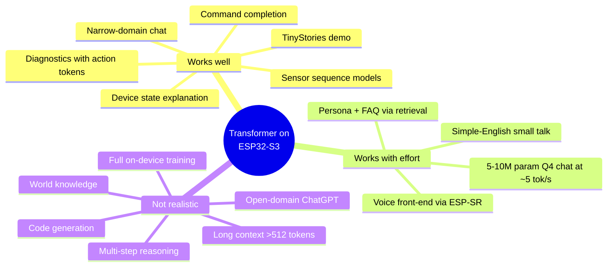
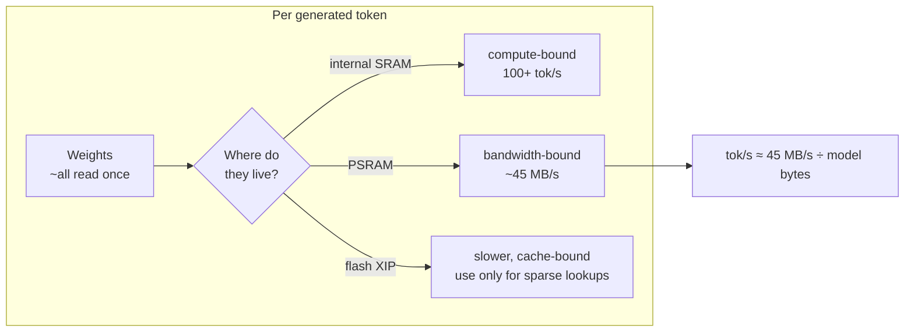
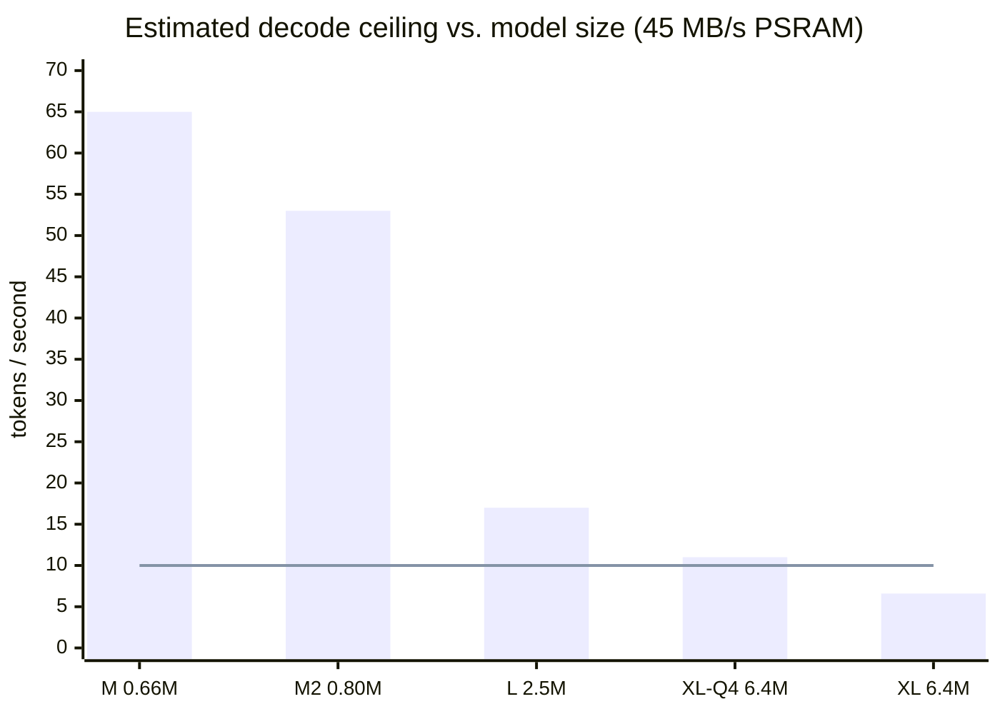
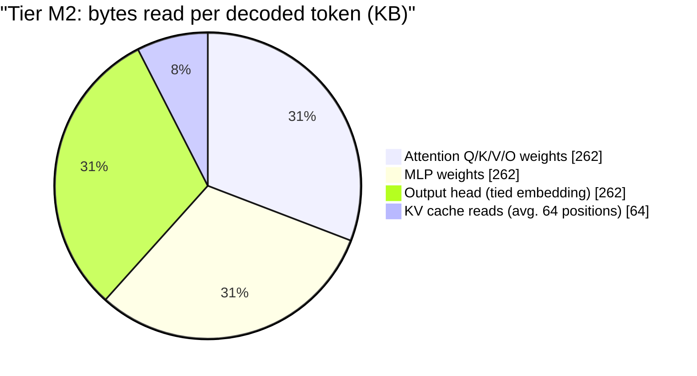
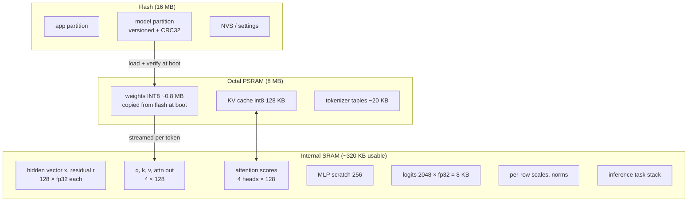

# 01 — Feasibility: what a transformer can do on one ESP32-S3

> **Status of numbers.** No board is attached yet. Every on-device number in this document
> is either **[measured by others]** (with a link) or **[estimate]** (with the formula).
> The estimator is reproducible: `tools/estimate.py` (see
> [06-implementation-plan.md](06-implementation-plan.md), phase P1) regenerates the tables.
> Once hardware is available, the benchmark harness replaces estimates with measurements.

## 1. The short answer

A real, inspectable, decoder-only transformer — tokenizer, embeddings, causal
self-attention with a KV cache, MLP, RMSNorm, logits, sampling — **fits comfortably and
runs at interactive speed** on an ESP32-S3 N16R8, as long as the model stays in the
**0.2–3 M dense-parameter** range. That is enough for:

- a **narrow-domain conversational assistant** (device control, state explanation,
  diagnostics) that is genuinely useful;
- a **TinyStories-class story generator** as a correctness/speed proof;
- **sequence models for sensor data** (anomaly detection, gestures) on the same runtime.

It is **not** enough for open-domain chat, world knowledge, reasoning, code, or
multilingual output. [03-chat-model.md](03-chat-model.md) explores how far toward "real
chat" we can push.



## 2. The hardware budget

| Resource | ESP32-S3 N16R8 | Consequence for a transformer |
|---|---|---|
| CPU | 2 × Xtensa LX7 @ 240 MHz, 128-bit PIE SIMD (int8/int16 MAC) | Arithmetic is cheap: a 1 M-param model needs ~1 M MAC/token |
| Internal SRAM | 512 KB (≈ 300–350 KB usable by the app) | Hot vectors, scratch, stacks — or a whole ≤ 250 K-param INT8 model |
| Data cache | up to 64 KB | Everything from PSRAM/flash streams through it |
| Octal PSRAM | 8 MB @ 80 MHz DDR | **The bottleneck**: weights are re-read once per generated token |
| Flash | 16 MB (quad, memory-mappable) | Model storage; flash-resident lookup tables (per-layer embeddings) |

Sources: [ESP32-S3 datasheet](https://www.espressif.com/sites/default/files/documentation/esp32-s3_datasheet_en.pdf),
[ESP-IDF external RAM guide](https://docs.espressif.com/projects/esp-idf/en/latest/esp32s3/api-guides/external-ram.html).

### Effective PSRAM bandwidth — derived from published measurements

| Project | Data point | Implied effective bandwidth |
|---|---|---|
| [doryiii/esp32-llm](https://github.com/doryiii/esp32-llm) | 3.3 M INT8 model, 12 tok/s, "bandwidth limit 13.1 tok/s" | 3.3 MB × 13.1/s ≈ **43 MB/s** [measured by others] |
| [slvDev/esp32-ai](https://github.com/slvDev/esp32-ai/blob/main/RESULTS.md) | 32768 × 96 INT8 output head (3.1 MB) in 57.6 ms, dual core | ≈ **54 MB/s** [measured by others] |

We plan with **45 MB/s** and a realistic-efficiency band of 50–90 % of the resulting
ceiling.

## 3. The roofline: why bytes, not MACs, decide speed

For single-token decode every weight matrix is used exactly once, as a matrix-vector
product (GEMV). Arithmetic intensity is ≈ 1 MAC per weight byte (INT8). The PIE unit can
do far more MACs per second than PSRAM can deliver bytes, so:

```text
decode time per token  ≈  (weight bytes + KV bytes read) / effective memory bandwidth
                           + small fixed overhead (norms, softmax, sampling, tokenizer)
tokens/s ceiling       ≈  45 MB/s / bytes read per token
```



Consequences that drive the whole design:

1. **Model bytes per token are the currency.** INT8 instead of FP32 is a ~4× speed-up,
   not just a size reduction. INT4 can add up to 2× more if unpacking stays cheap.
2. **The output head counts.** A tied `V × d_model` head is read every token; with a
   32 K vocabulary it dominated the slvDev design (57.6 of ~103 ms). We keep `V` at
   512–4096.
3. **The second core helps compute-bound stages only.** Once a stage is
   bandwidth-bound, two cores fight over the same PSRAM bus
   ([doryiii](https://github.com/doryiii/esp32-llm) deliberately stays single-core;
   [DaveBben](https://github.com/DaveBben/esp32-llm) gained from dual-core on FP32).
4. **Prompt prefill can be batched.** Processing a block of known prompt tokens reuses each
   fetched weight row for all of them, turning GEMV into a small GEMM. A 48-token prompt
   costs ~0.7 s naively on tier M but ~0.1 s with 8-token blocks [estimate].

## 4. Model tiers

All tiers share one runtime and one binary format; only the numbers change.

| Tier | Layers × width | FFN | Vocab | Context | Dense params | Weight bytes | KV cache (int8) | Placement |
|---|---|---|---:|---:|---:|---:|---:|---|
| **S** — SRAM-only | 2 × 96 | 192 | 512 | 32 | 0.20 M | 200 KB | 12 KB | internal SRAM |
| **M** — core product | 4 × 128 | 256 | 1024 | 64 | 0.66 M | 0.66 MB | 64 KB | PSRAM |
| **M2** — vision baseline | 4 × 128 | 256 | 2048 | 128 | 0.80 M | 0.79 MB | 128 KB | PSRAM |
| **L** — chat-lite | 6 × 192 | 512 | 2048 | 128 | 2.48 M | 2.46 MB | 288 KB | PSRAM |
| **XL** — chat (INT8) | 8 × 256 | 768 | 4096 | 256 | 6.36 M | 6.29 MB | 1 MB | PSRAM (tight) |
| **XL-Q4** — chat (4-bit) | 8 × 256 | 768 | 4096 | 256 | 6.36 M | 3.54 MB | 1 MB | PSRAM |

Parameter formula (tied embeddings, learned positions, plain two-matrix MLP):
`P = L·(4·d² + 2·d·d_ff) + V·d + ctx·d`. Q4 bytes include one FP16 scale per 32 weights.

### Estimated decode speed

| Tier | Bytes read / token | Ceiling @ 45 MB/s | Expected on device | Output-head share |
|---|---:|---:|---:|---:|
| S | (SRAM) | compute-bound | **100+ tok/s** | — |
| M | 0.69 MB | 65 tok/s | **30–55 tok/s** | 19 % |
| M2 | 0.85 MB | 53 tok/s | **25–45 tok/s** | 31 % |
| L | 2.6 MB | 17 tok/s | **9–15 tok/s** | 15 % |
| XL INT8 | 6.8 MB | 6.6 tok/s | **3–6 tok/s** | 15 % |
| XL Q4 | 4.1 MB | 11 tok/s | **5–9 tok/s** | 15 % |

All values **[estimate]**; "expected" = 50–90 % of the ceiling, the band observed in the
projects above. The vision's gate is ≥ 5 tok/s minimum and ≥ 10 tok/s good: tiers S, M,
M2 and L clear it with margin.



The line marks the vision's "good" gate of 10 tok/s.

### Where the time goes (tier M2, estimate)



## 5. Memory map for tier M2



Total runtime footprint ≈ 1.1 MB, far below the vision's 4 MB ceiling — which leaves
room for tier L on the same board.

## 6. Energy [estimate]

The ESP32-S3 draws roughly 0.3–0.6 W with both cores busy and PSRAM active (datasheet
current figures × 3.3 V, plus PSRAM). At 30 tok/s that is ≈ **10–20 mJ per token**;
a 20-token answer costs well under half a joule. Measuring this is vision research
branch H and needs hardware.

## 7. Verdict per vision requirement

| Vision requirement | Feasible? | Notes |
|---|---|---|
| Real transformer components (§2) | **Yes** | all implemented in our C runtime |
| ≥ 5 tok/s for ~1 M INT8 | **Yes, large margin** | ~25–55 tok/s expected |
| < 4 MB runtime footprint | **Yes** | ~1.1 MB for M2 |
| 128-token context | **Yes** | KV cache 128 KB int8 |
| Useful narrow-domain assistant (§4 C) | **Yes, if data is designed well** | the hard part is the dataset, not the chip |
| General chat | **No** at interactive speed | see [03-chat-model.md](03-chat-model.md) |
| Hardware-in-the-loop CI | **Later** | needs the board; harness built now |

Next: [02-use-cases.md](02-use-cases.md).
