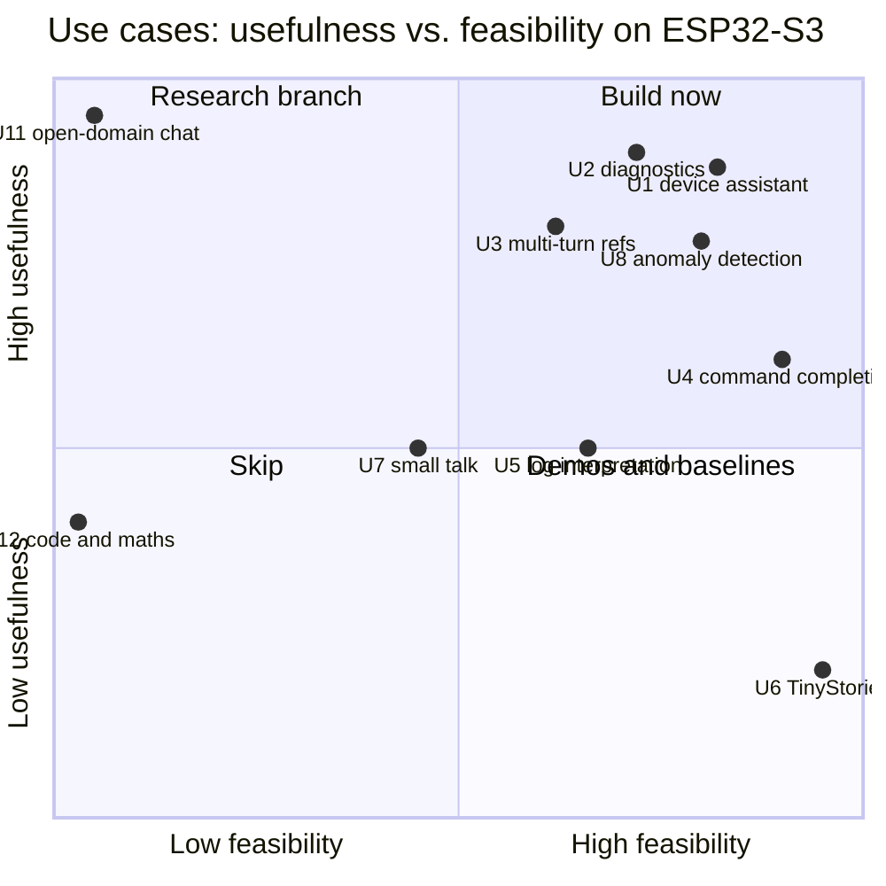
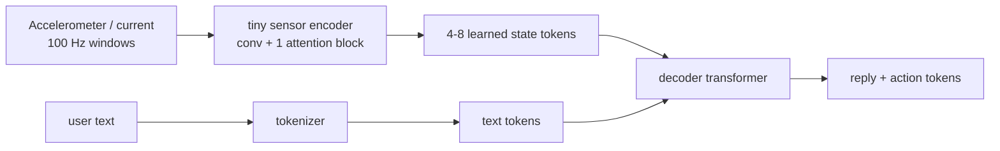

# 02 — What can we actually do with transformers on this MCU?

This page reviews use cases from several angles (usefulness, feasibility, how much
"language model" they really exercise) and picks the product direction.

## 1. Use-case catalogue

| # | Use case | Model type | Tier | Usefulness | Feasibility | Exercises LM machinery |
|---|---|---|---|---|---|---|
| U1 | **Device assistant**: state + question → short answer + validated action | decoder LM | M/M2 | high | high | full |
| U2 | **Diagnostics**: state + fault flags + short history → explanation + `<diag>` token | decoder LM | M2/L | high | high | full |
| U3 | Multi-turn control with references ("lower it a bit", "the other one") | decoder LM | M2 | high | medium-high | full (needs attention over turns) |
| U4 | Command completion / normalisation of typed or spoken commands | decoder LM | S/M | medium | very high | partial |
| U5 | Log-line / protocol-message interpretation | decoder LM | M | medium | high | full |
| U6 | TinyStories continuation (proof of platform) | decoder LM | M/M2 | low (demo) | very high | full |
| U7 | Simple-English small talk with a persona | decoder LM | L/XL | medium (fun, companion toys) | medium | full |
| U8 | Vibration / current anomaly detection | encoder over sensor tokens | S | high (industrial) | high | attention yes, text no |
| U9 | Accelerometer gesture classification | encoder | S | medium | high | attention yes, text no |
| U10 | Keyword/intent spotting from ESP-SR output | tiny classifier | S | medium | very high | minimal |
| U11 | Open-domain Q&A / general chatbot | decoder LM | — | would be high | **not feasible** | — |
| U12 | Code generation, translation, maths | decoder LM | — | — | **not feasible** | — |



## 2. The chosen product: a narrow conversational diagnostic/control assistant

Exactly the vision's end-state (§1, Milestone C). One simulated device world —
**"Greenhouse controller"**, chosen because it has intuitive sensors and actuators and
plenty of diagnostic cause/effect:

| Entities | Properties / sensors | Actions (validated by firmware) | Diagnoses |
|---|---|---|---|
| fan, heater, pump, light, window, vent motor | temperature, humidity, soil moisture, light level, fan level, pump current, motor current, vibration, fault code | `fan=0..3`, `heater=on/off`, `pump=on/off`, `light=0..100`, `window=open/close`, `ack=<code>` | high humidity, overheating, dry soil, pump blocked/dry-run, fan bearing wear, sensor offline, heater fault, window obstructed |

That gives roughly **30 actions and 12 diagnoses** — inside the vision's 20–50 target —
and naturally produces:

- state grounding ("why is it humid?" → read `h=` from the state block);
- references ("turn it down" → the thing we just talked about);
- clarification ("which one?" when two fans exist);
- refusals ("set the heater to 90 °C" → out of range → `<unsupported>`);
- diagnostics chains ("pump current is high while flow is zero → blocked pump").

### Prompt and output format (token-efficient, parser-friendly)

```text
<bos><S> t=31.2 h=78 soil=41 fan=0 heat=0 pump=0 light=0 win=1 pa=0.0 vib=0 err=0</S>
<U> why is it still so sticky in here</U><A>
 humidity is 78 percent and the fan is off. setting the fan to level 2.</A><ACT> fan=2</ACT><eos>
```

(One line in reality; wrapped here. The exact layout is defined in
`training/data/textformat.py` and mirrored by the C console.) The state block costs
34 tokens with the trained tokenizer, a typical single-turn sample about 69 tokens, so a
128-token context holds the state plus up to three previous exchanges.

The model **proposes**; a deterministic parser + validator decides (see
[05-architecture.md](05-architecture.md) §Safety).

## 3. Why not "just a classifier"?

A classifier (U10) would handle single-shot commands faster. The vision explicitly wants
to *exercise the language-model machinery*, and the interesting parts — references across
turns, grounding in state, generating an explanation — need a generative model. We keep a
**falsifiability check** (vision §29): the evaluation suite also runs a deterministic
rule/keyword baseline. If the transformer cannot beat it meaningfully on the held-out and
robustness suites, we say so.

## 4. Sensor-sequence transformers (kept open, not in v1)

The runtime's model format does not assume tokens came from UTF-8 text (vision §5). A
sensor encoder that maps windows of samples to "state tokens" can later be prepended to
the text context:



Prior art that shows transformer-style models doing real signal work on the S3:
[conformer-stt-s3](https://github.com/lspr98/conformer-stt-s3) (13.1 M-param
Conformer ASR, Apache-2.0).

## 5. Voice as a front-end (option)

Espressif's [ESP-SR](https://github.com/espressif/esp-sr) (WakeNet/MultiNet) already runs
wake-word and command recognition on the S3. A realistic interactive device is:
wake word → speech commands or a small ASR → **our LM** → validated action. This is out of
v1 scope but the serial/text interface is designed so a speech front-end can feed it.

Next: [03-chat-model.md](03-chat-model.md) — how far toward a *real* chat model can we go?
