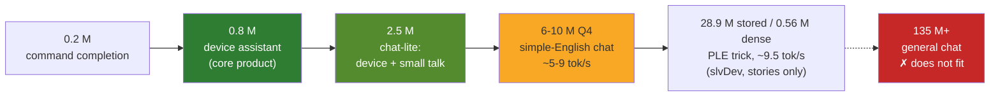
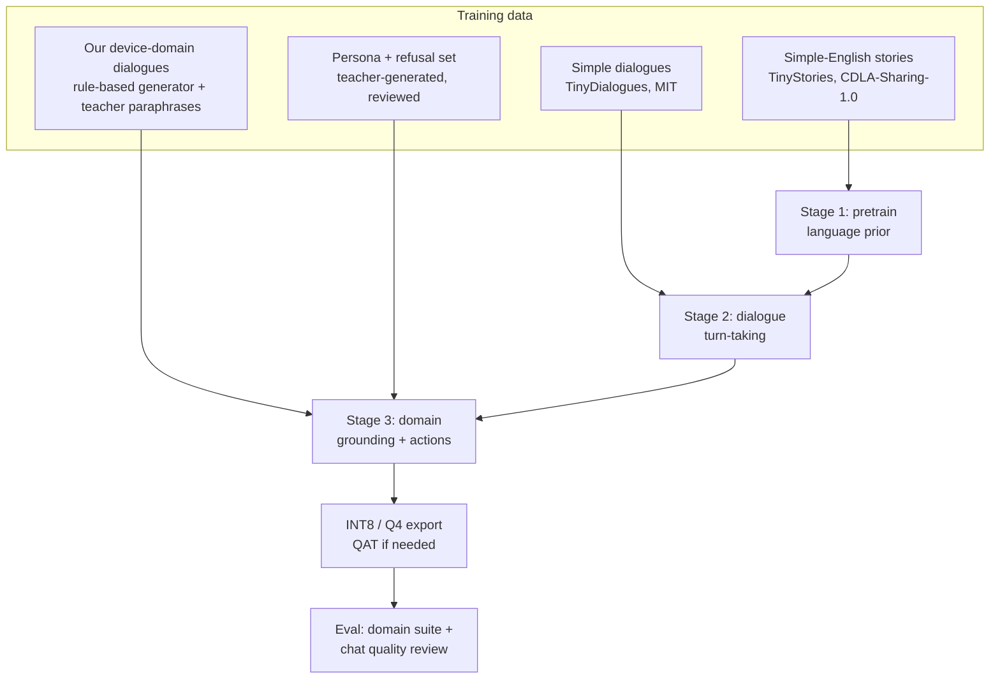

# 03 — Toward a *real* chat model on the ESP32-S3

The vision deliberately starts narrow. This page asks the opposite question: **how close
to a "real" chat model can we get on one ESP32-S3, and what does it cost?**

## 1. What "real chat" needs, and what it costs in parameters

| Chat capability | Rough capacity where it appears | Fits ESP32-S3 at ≥ 5 tok/s? |
|---|---|---|
| Grammatical simple English, local coherence | ~1–3 M params on simplified data ([TinyStories](https://arxiv.org/abs/2305.07759)) | **yes** (tier M2/L) |
| Following simple instructions in a restricted language | ~3–30 M params ([TinyStories-Instruct](https://arxiv.org/abs/2305.07759)) | **partly** (tier L/XL-Q4) |
| Turn-taking, simple dialogue with a persona | few M params on simplified dialogue data ([TinyDialogues](https://arxiv.org/abs/2408.03617)) | **yes, in simple English** |
| Grounded answers about its own device/state | < 1 M params with a closed domain | **yes** — our core product |
| World knowledge, open-domain Q&A | 100 M–1 B+ ([SmolLM2-135M](https://arxiv.org/abs/2502.02737) is the smallest useful general model) | **no** — 135 M params ≈ 68 MB at 4 bit, bigger than flash |
| Multi-step reasoning, code, maths | billions | **no** |

The line between "fits" and "doesn't" is roughly **10 M dense parameters**, set by the
PSRAM bandwidth (see [01-feasibility.md](01-feasibility.md) §4) and 16 MB flash.

## 2. The "chat-lite" design (tier L, ~2.5 M params)

A realistic "real chat" target on this chip is a **simple-English conversational
companion that also owns its device domain**:

- **Language:** restricted simple English (a TinyStories/TinyDialogues-style register),
  2 K-token vocabulary, 128-token context.
- **Persona:** a fixed, consistent character ("I am the greenhouse helper") so capacity
  isn't wasted on identity drift.
- **Skills:** greetings, small talk, feelings/opinions in simple words, explaining its own
  sensors, answering "what can you do?", politely declining out-of-scope questions.
- **Grounding:** the state block `<S> … </S>` is always present, so small talk can
  reference the real device ("it is warm today — 29 degrees in here").
- **Speed:** 9–15 tok/s [estimate] — interactive.

What it will *not* do: know who won a football match, write code, or reason in several
steps. It must say so, and the training data teaches it to.

## 3. Techniques that stretch capacity further

Each technique below is a known idea from published work; we cite the source and treat
it as a hypothesis to measure, not a promise.

| Technique | Idea | Why it helps on the S3 | Source |
|---|---|---|---|
| **Per-layer embeddings (PLE) in flash** | big lookup tables in flash, read sparsely per token; small dense core | adds lexical capacity almost for free in bandwidth | [slvDev/esp32-ai](https://github.com/slvDev/esp32-ai), [manjunathshiva/esp32-tinyllm](https://github.com/manjunathshiva/esp32-tinyllm) (both MIT), idea from Gemma 3n |
| **Q4 / ternary weights** | fewer bytes per weight | directly raises the bandwidth ceiling | [JARACH-209/esp32-30.7M](https://github.com/JARACH-209/esp32-30.7M) (MIT), [BitNet b1.58](https://arxiv.org/abs/2402.17764) |
| **Deep-and-thin + weight sharing** | more layers, shared blocks | more depth for the same stored bytes | [MobileLLM](https://proceedings.mlr.press/v235/liu24ce.html), [ALBERT](https://arxiv.org/abs/1909.11942) |
| **Factorised embeddings** | `V × 64` table + `64 × d` projection | shrinks the output head, the per-token hotspot | [ALBERT](https://arxiv.org/abs/1909.11942) |
| **Retrieval of facts** | look up 1–2 short fact records by keyword and inject them | knowledge without parameters | vision §24 D; classic RAG idea ([Lewis et al.](https://arxiv.org/abs/2005.11401)) |
| **Grammar-constrained decoding** | mask logits so action blocks are always well-formed | a tiny model cannot emit malformed actions | idea as in [llama.cpp grammars](https://github.com/ggml-org/llama.cpp/blob/master/grammars/README.md) (MIT) |
| **Sliding-window chat memory** | keep last N tokens + firmware-summarised state | long conversations without growing KV cache | vision §24 C |
| **Hybrid escalation** (optional) | on-device model answers or says "ask the cloud" | honest scope boundary for a product | design choice; off by default (fully local is the goal) |

## 4. How we would train the chat-lite model

The distillation side (which teachers, which losses, which licences) is in
[04-distillation.md](04-distillation.md).

## 5. Recommendation

1. **Ship the core product first** (tier M2 device assistant). It is the part that can be
   genuinely *good*.
2. **Build chat-lite (tier L) as the second model** on the same runtime, once INT8 and the
   data pipeline work. It answers "is this a real chat model?" honestly: yes, in simple
   English, about itself and its world.
3. **Run the capacity sweep** (vision M8) including one Q4 XL model, so the report shows
   exactly where chat quality stops improving per tok/s lost.
4. Do **not** chase general knowledge on this chip. If that is ever needed, the upgrade
   path is hardware: e.g. the [ESP32-P4](https://www.espressif.com/en/products/socs/esp32-p4)
   (dual RISC-V @ 400 MHz, up to 32 MB in-package PSRAM) would roughly double the
   feasible model size — but it has no Wi-Fi and is out of scope here.

Next: [04-distillation.md](04-distillation.md).
