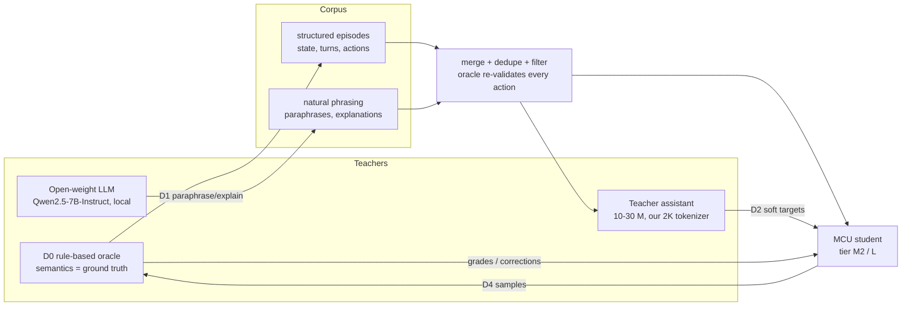
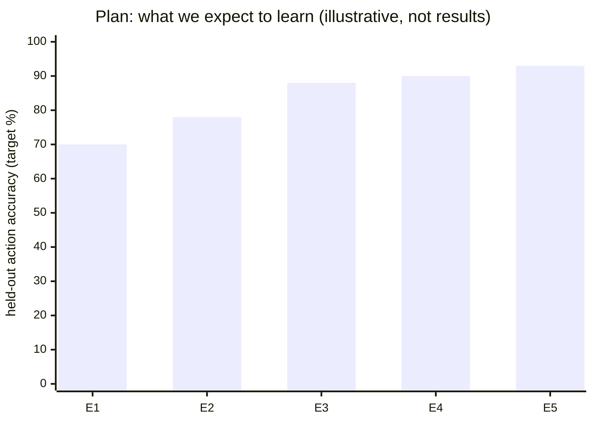

# 04 — Distilling from larger LLMs

Distillation is how a < 3 M-parameter student inherits behaviour it could never learn from
a small hand-written dataset. This page reviews the options, picks teachers whose licences
allow it, and defines the experiments. Vision reference: §8, §9, M5, M6.

## 1. Options, from simplest to most ambitious

| ID | Method | What the teacher provides | Tokenizer constraint | Cost | Source |
|---|---|---|---|---|---|
| **D0** | **Rule-based oracle** (our device simulator) | exact actions, diagnoses, refusals, state facts | none | free, unlimited | our code |
| **D1** | **Sequence-level KD** | paraphrases of user turns, natural explanations, persona/small-talk replies | none (text only) | teacher inference time | [Kim & Rush 2016](https://arxiv.org/abs/1606.07947), [Self-Instruct](https://arxiv.org/abs/2212.10560), [Alpaca](https://crfm.stanford.edu/2023/03/13/alpaca.html) |
| **D2** | **Teacher-assistant logit KD** | soft next-token distributions from a 10–30 M model *we* train with *our* tokenizer | same vocab by construction | one extra GPU training run | [Hinton et al. 2015](https://arxiv.org/abs/1503.02531), [TAKD, Mirzadeh et al. 2019](https://arxiv.org/abs/1902.03393) |
| **D3** | Hidden-state / attention KD from the assistant | intermediate representations | same vocab, projection layers | moderate | [TinyBERT](https://arxiv.org/abs/1909.10351), [MiniLM](https://arxiv.org/abs/2002.10957) |
| **D4** | **On-policy distillation** | teacher/oracle feedback on the *student's own* samples | none for oracle grading | loop cost | [GKD, Agarwal et al.](https://arxiv.org/abs/2306.13649), [MiniLLM, Gu et al.](https://arxiv.org/abs/2306.08543) |
| **D5** | Cross-tokenizer logit KD straight from a big LLM | full distributions from a 1–8 B model | different vocab — needs optimal-transport/likelihood matching | high, research | [ULD, Boizard et al.](https://arxiv.org/abs/2402.12030), [ALM](https://arxiv.org/abs/2503.20083) |

### Key design decision: semantics from the oracle, language from the LLM

The teacher LLM **never decides what the correct action is**. The rule-based simulator
generates each episode's ground truth (state, intent, action, diagnosis). The LLM only
rewrites *how* the user asks and *how* the assistant explains. Every generated sample is
re-checked by the oracle; samples whose action/diagnosis changed are discarded. This keeps
labels exact while giving the student diverse, natural language — and it means the
product still works (with less varied phrasing) even if no teacher is available.

## 2. Teacher selection and licence matrix

We only use teachers whose terms clearly allow using outputs to train and publish another
model. Checked on the Hugging Face model cards on 2026-09-28; **re-check before each data
generation run** and record the result in the dataset manifest.

| Teacher | Licence | Use outputs for training? | Decision |
|---|---|---|---|
| [Qwen2.5-7B-Instruct](https://huggingface.co/Qwen/Qwen2.5-7B-Instruct) | Apache-2.0 | yes | **default teacher** |
| [Qwen2.5-1.5B-Instruct](https://huggingface.co/Qwen/Qwen2.5-1.5B-Instruct) | Apache-2.0 | yes | fast fallback / CI smoke |
| [Qwen3.5-4B](https://huggingface.co/Qwen/Qwen3.5-4B) | Apache-2.0 | yes | **used for the committed paraphrases** (already installed locally; see §3) |
| [Qwen3-4B](https://huggingface.co/Qwen/Qwen3-4B), [Qwen3-8B](https://huggingface.co/Qwen/Qwen3-8B) | Apache-2.0 | yes | alternative |
| [SmolLM2-1.7B-Instruct](https://huggingface.co/HuggingFaceTB/SmolLM2-1.7B-Instruct) | Apache-2.0 | yes | alternative, fully open data |
| [Phi-4-mini-instruct](https://huggingface.co/microsoft/Phi-4-mini-instruct) | MIT | yes | alternative |
| [Mistral-7B-Instruct-v0.3](https://huggingface.co/mistralai/Mistral-7B-Instruct-v0.3) | Apache-2.0 | yes | alternative |
| [OLMo-2-7B-Instruct](https://huggingface.co/allenai/OLMo-2-1124-7B-Instruct), [Granite-3.3-8B](https://huggingface.co/ibm-granite/granite-3.3-8b-instruct) | Apache-2.0 | yes | alternatives |
| [Qwen2.5-3B-Instruct](https://huggingface.co/Qwen/Qwen2.5-3B-Instruct) | Qwen research licence ("other") | restricted | **avoid** |
| [Llama 3.2 3B](https://huggingface.co/meta-llama/Llama-3.2-3B-Instruct) | Llama 3.2 Community Licence | allowed, but derived models must carry "Llama" naming/attribution | avoid (naming obligations) |
| [Gemma 3](https://huggingface.co/google/gemma-3-4b-it) | Gemma Terms of Use | distilled models count as "Model Derivatives" bound by Gemma terms | **avoid** |
| Commercial APIs (OpenAI, Anthropic, Google) | provider terms | restrictions on using outputs to build competing models | **not used for training data**; optional LLM-as-judge in evaluation only |

Datasets reused as-is:

| Dataset | Licence | Provenance note |
|---|---|---|
| [TinyStories](https://huggingface.co/datasets/roneneldan/TinyStories) | CDLA-Sharing-1.0 | generated with GPT-3.5/4 by the authors; share-alike for data we redistribute |
| [TinyDialogues](https://huggingface.co/datasets/styfeng/TinyDialogues) | MIT | generated with GPT-4 by the authors |
| [llama2.c tinyllamas](https://huggingface.co/karpathy/tinyllamas) checkpoints | MIT | used only as a numerical oracle / hardware sanity check (vision M1) |

## 3. Running the teacher locally

**What we actually ran (2026-09-28):** `python -m training.data.teacher` against Ollama's
`qwen3.5:4b` (Q4_K_M, Apache-2.0, thinking disabled) on the RTX A2000 — about 41 tok/s,
2 seeds × 90 semantic keys in ≈ 16 minutes. The strict filter accepted **1531 of 2199**
lines (70 %); rejections were lost devices/numbers, flipped meanings ("turn off" in an
"on" request), stray numbers, non-ASCII, and anything matching a held-out frame. The
result is committed as `data/teacher/paraphrases.json` (80 % train / 20 % test per key,
with the teacher name, licence and prompt recorded), so builds never need the GPU.

The original plan was:

The dev machine has an RTX A2000 (8 GB) and [Ollama](https://ollama.com/). A 7 B model at
4-bit runs at roughly 30–45 tok/s there [estimate], so ~20 k paraphrases × ~20 tokens
≈ 0.4 M tokens ≈ **3–4 GPU-hours**. The generator:

- is resumable and content-addressed (cache key = teacher, version, prompt hash, seed);
- writes a manifest: teacher name + digest, licence, prompt templates, seeds, counts;
- is optional: the committed pipeline and CI use the oracle-only corpus plus a small
  committed, reviewed teacher sample, so builds never depend on a GPU or network.

## 4. The experiments (vision M6, extended)

Same student architecture, same tokenizer, same quantisation, same token budget:

| Run | Pretraining | Domain data | Distillation | Question it answers |
|---|---|---|---|---|
| **E1** scratch | — | oracle corpus | — | baseline |
| **E2** pretrained | TinyStories subset | oracle corpus | — | does a language prior help? |
| **E3** seq-KD | TinyStories subset | oracle + teacher paraphrases | D1 | does teacher phrasing help? |
| **E4** TA-KD | TinyStories subset | oracle + teacher | D1 + D2 | do soft targets help at this size? |
| **E5** on-policy | from best of E1–E4 | + student samples graded by oracle | D4 | does fixing exposure bias help? |

Metrics (see [06-implementation-plan.md](06-implementation-plan.md) §Evaluation): exact
action accuracy, parameter accuracy, clarification/unsupported accuracy, reference
resolution, hallucinated-entity rate, response-length violations, validation loss —
reported for FP32 and INT8, on the in-distribution **and** the held-out-template suite,
next to the deterministic non-neural baseline.

*The chart shows hypotheses to test, not measurements. Real numbers go in
`docs/results/` once the runs exist.*

## 5. Pitfalls we plan around

- **Template memorisation.** The held-out suite uses different templates *and* different
  teacher prompts than training; we report both.
- **Teacher hallucinating device facts.** The oracle re-validation step drops them.
- **Style too rich for the student.** We ask the teacher for short, plain sentences — the
  lesson from TinyStories/[TinyHelen](https://arxiv.org/abs/2501.00522) is that lower
  lexical entropy makes tiny models better.
- **Licence drift.** Teacher terms can change; the manifest pins what was true at
  generation time.

Next: [05-architecture.md](05-architecture.md).
