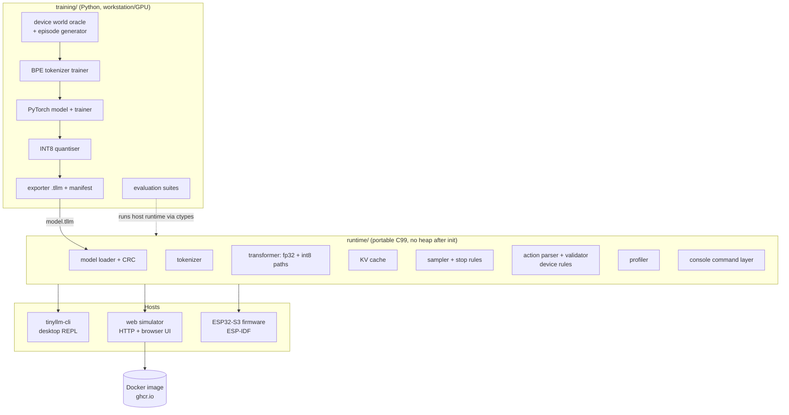
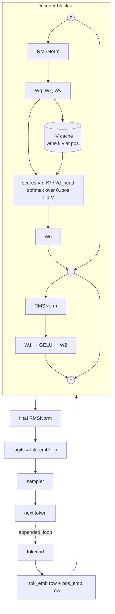
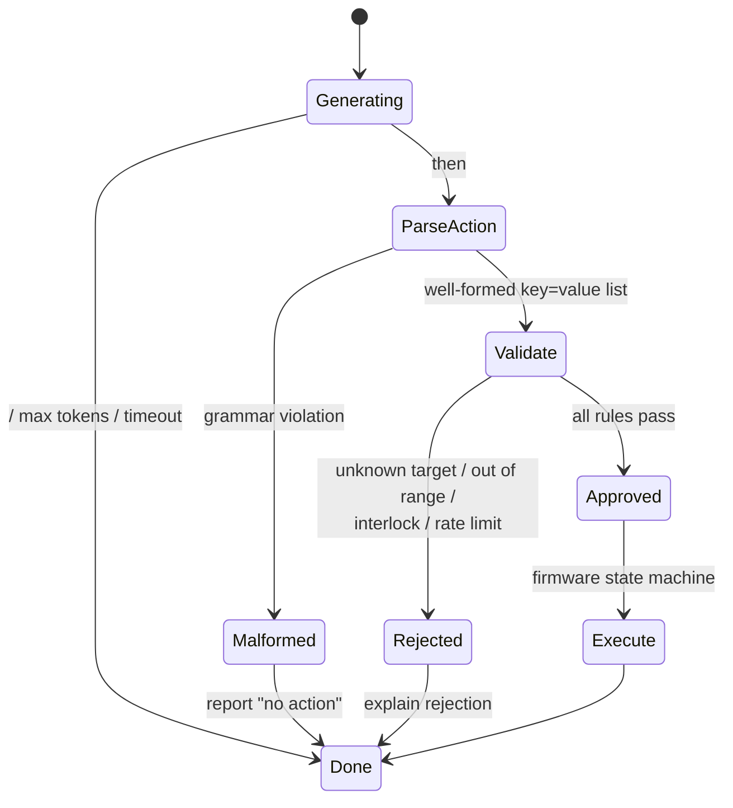
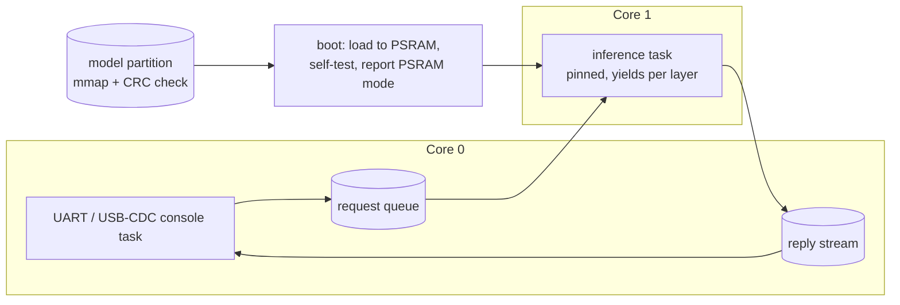
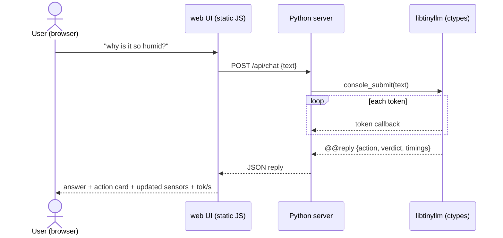

# 05 — System architecture

This is the concrete design the implementation follows. Changes to anything here (file
format, protocol, memory placement, safety boundary) must update this page in the same
commit (see [AGENTS.md](../AGENTS.md) §1).

## 1. Big picture

One portable C99 runtime, three hosts: the desktop CLI, the web simulator (and its Docker
image), and the ESP32-S3 firmware. Python owns everything that happens before deployment.



## 2. Transformer (what we can point at)

Decoder-only, pre-norm, tied embeddings. Every item from vision §2 maps to a function:

| Vision component | Runtime location |
|---|---|
| token embeddings | `tllm_embed()` in `transformer.c` |
| positional information | learned table, `pos_emb` (RoPE flag reserved in format) |
| decoder blocks × L | loop in `tllm_forward()` |
| normalisation | `tllm_rmsnorm()` in `kernels.c` |
| Q/K/V projections | `tllm_matvec_*()` over `wq`, `wk`, `wv` |
| causal masking + attention | `tllm_attention()` — only positions `0..pos` exist in the cache |
| KV cache | `kv_cache.c`, fp32 or int8-per-row-scaled |
| residual connections | `x += …` after attention and MLP |
| MLP | `tllm_mlp()` — GELU two-matrix or SwiGLU three-matrix (format flag) |
| final norm, vocab projection | `tllm_forward()` tail, tied `tok_emb` |
| next-token selection | `sampler.c`: greedy, temperature, top-k, repetition penalty |



Supported hyper-parameters (all read from the model header): `n_layers`, `d_model`,
`n_heads`, `n_kv_heads` (MHA/GQA/MQA), `d_ff`, `vocab_size`, `ctx_len`, `mlp_type`,
`pos_type`, `weight_dtype` (`f32`, `i8`).

### Quantisation formats

| Mode | Weights | Activations | Accumulate | Purpose |
|---|---|---|---|---|
| `f32` | fp32 | fp32 | fp32 | reference, bit-comparable with PyTorch |
| `i8` weight-only (W8A32) | int8, one fp32 scale per output row | fp32 | fp32 | vision O3 — simplest INT8 |
| `i8` W8A8 | int8 per-row | int8 dynamic per-vector scale | int32 | vision O4 — the path PIE/ESP-NN accelerate |
| `q4` W4A32 / W4A8 | 4-bit, groups of 32 per row, one float16 scale per group (0.5625 B/weight) | fp32 or int8 | fp32 / int32 per group | vision O9 — halves weight traffic; matrices whose width is not a multiple of 32 stay int8 |

Norm weights, positional table and scales stay fp32 (vision §11 "mixed precision").

## 3. Model file format `.tllm` v1

Little-endian, every tensor 16-byte aligned (vector loads), no allocation while parsing:
tensors are used **in place** from the loaded/mapped blob.

| Offset | Field | Type |
|---|---|---|
| 0 | magic `"TLLM"` | 4 × u8 |
| 4 | format version (= 1) | u32 |
| 8 | header size | u32 |
| 12 | architecture id (1 = decoder-only) | u32 |
| 16 | `vocab_size, ctx_len, n_layers, d_model, n_heads, n_kv_heads, d_ff` | 7 × u32 |
| 44 | `mlp_type, pos_type, weight_dtype, flags` | 4 × u32 |
| 60 | `tokenizer_offset, tokenizer_size` | 2 × u32 |
| 68 | `tensor_table_offset, tensor_count` | 2 × u32 |
| 76 | `payload_size` | u32 |
| 80 | `payload_crc32` (IEEE, everything after the header) | u32 |
| 84 | `model_id` (first 16 bytes of SHA-256 of training manifest) | 16 × u8 |
| 100 | `norm_eps` | f32 |
| 104 | `rope_theta` | f32 |
| 108 | reserved (zero) | 20 × u8 |

The tensor table holds `{name[32], dtype, n_dims, dims[4], data_offset, data_size,
scale_offset}` per tensor (68 bytes each; `dtype` 0 = f32, 1 = i8, 2 = q4 — two
nibbles per byte, low nibble first, value + 8, followed by little-endian float16 group scales; `scale_offset` =
`0xFFFFFFFF` for unscaled tensors). Tensor order and names: `tok_emb`, `pos_emb` (learned
positions only), then per layer `l{i}.attn_norm, wq, wk, wv, wo, mlp_norm, w1, w2[, w3]`,
then `final_norm`. Matrices are stored `[out, in]` row-major, so every output element is a
contiguous dot product; INT8 matrices are followed by one f32 scale per row. The exporter also writes `model.manifest.json` with names,
shapes, dtypes, offsets, hashes, and training provenance (vision §14, §29).

The loader rejects: wrong magic, unknown version, header/arch mismatch, sizes that don't
add up, CRC mismatch, `ctx_len`/`d_model` above compile-time limits, and unknown dtypes.
**Never load a model whose architecture/version is incompatible with the runtime.**

## 4. Tokenizer

- Byte-level BPE trained by our own deterministic trainer (`training/tokenizer/`), so
  every UTF-8 input is encodable (no unknown token).
- IDs `0..N_SPECIAL-1` are control tokens: `<pad> <bos> <eos> <S> </S> <U> </U> <A> </A>
  <ACT> </ACT> <clarify> <unsupported>`; then 256 byte tokens; then merges.
- Pre-tokenisation splits letters, single digits, spaces-with-word, and punctuation, so
  numbers like `31.2` tokenize predictably.
- Deployed form: token byte strings + ranked merge list; encoding applies the lowest-rank
  merge repeatedly using a fixed-size open-addressing pair→rank table built at load time.
- **Round-trip tests run the same fixture file in Python and C** (vision §7).

## 5. Runtime API (C)

```c
tllm_status tllm_model_load(tllm_model *m, const void *blob, size_t size);   /* in place */
size_t      tllm_hot_arena_size(const tllm_model *m);                        /* exact */
size_t      tllm_cold_arena_size(const tllm_model *m, int kv_int8);          /* KV cache */
tllm_status tllm_ctx_init(tllm_ctx *c, tllm_model *m, const tllm_ctx_options *opt,
                          void *hot, size_t hot_size, void *cold, size_t cold_size);
tllm_status tllm_forward(tllm_ctx *c, int32_t token, const float **logits);
tllm_status tllm_prefill(tllm_ctx *c, const int32_t *tokens, uint32_t n, const float **logits);
int32_t     tllm_sample(float *logits, uint32_t n, const tllm_sampler_cfg *cfg, tllm_rng *rng,
                        const int32_t *recent, uint32_t n_recent);
int         tllm_tokenize(const tllm_tokenizer *t, const char *text, size_t len, int32_t *out, int max);
void        tllm_console_line(tllm_console *con, const char *line);          /* §7 protocol */
```

All working memory comes from **two caller-provided arenas** sized by the functions
above: the *hot* arena (activations, logits, tokenizer hash table — internal SRAM on the
ESP32, ~24 KB for tier M) and the *cold* arena (KV cache — PSRAM, 512 KB f32 / 128 KB int8
for tier M at 128 tokens). `tllm_prefill()` reuses the longest token prefix already in
the KV cache, so conversation history is not recomputed every turn (the state block sits
after the history for exactly this reason). On the host, `runtime/src/host.c` wraps
loading and arena allocation behind an opaque handle used by `tinyllm-cli`, the web
simulator, and the Python bindings (`tools/runtime.py`); its allocation counter proves in
tests that chatting performs zero heap allocations.

## 6. Safety boundary



- The **parser** is a small deterministic state machine accepting only
  `key=value( key=value)*` with keys from a fixed table and integer/enum values.
- The **validator** owns ranges, interlocks (e.g. `heater=on` rejected while
  `window=open` and `t > 30`; pump dry-run protection), and a rate limit per actuator.
- Execution on the simulator changes simulated state; on real hardware only this module
  would ever touch GPIOs. The model can propose; **firmware decides** (vision §10, §20).

## 7. Serial / console protocol

The same command layer (`console.c`) serves the desktop CLI, the web simulator, and the
firmware UART — so one test suite covers all three.

| Command | Effect |
|---|---|
| `<text>` | chat turn with the current state block |
| `/model-info` | architecture, dtype, params, bytes, model id, CRC |
| `/memory` | arena layout, KV bytes, heap/PSRAM high-water marks (firmware) |
| `/profile on\|off` | per-stage timing after each reply |
| `/kv-reset` | clear conversation |
| `/seed N`, `/temp X`, `/topk N`, `/max-tokens N` | sampler settings |
| `/state`, `/set key=value` | show / change the simulated device state |
| `/benchmark <case>` | run a fixed prompt, report prefill/decode tok/s |
| `/checksums` | per-layer checksums of the last forward (divergence hunting, vision §29) |
| `/generate TEXT` | continue a text like llama2.c's `run.c` (story mode; default for models without chat tokens) |
| `/execute on\|off` | apply approved actions to the simulated device, or only report them |
| `/reset` | conversation and simulated device back to defaults |
| `/bandwidth`, `/gemv` | firmware only: memory read bandwidth per tier, GEMV throughput ([08](08-firmware.md)) |

Every reply ends with one machine-readable line for the serial runner / HIL harness:

```text
@@{"event":"reply","text":"…","action":"fan=2","verdict":"approved","prompt_tokens":31,"gen_tokens":14,"prefill_ms":…,"decode_tok_s":…}
```

## 8. Firmware layout (ESP-IDF)



- `partitions.csv`: `nvs`, `phy_init`, `factory` app (3 MB), `model` data partition
  (subtype `0x40`, 8 MB) — the development layout from vision §29; OTA layout later.
- `sdkconfig.defaults`: 240 MHz, Octal PSRAM 80 MHz, 64 KB data cache, task watchdog
  enabled (inference task yields at layer boundaries), `-O2`.
- Kernels: reference C everywhere; `components/tinyllm_kernels/esp32s3/` adds ESP-DSP /
  ESP-NN-backed dot products once measured on hardware (vision O4). The runtime selects
  the kernel table at init, and debug builds keep the reference kernel for differential
  tests.

## 9. Web simulator and Docker image



The UI shows the device dashboard (sensors, actuators), the conversation, the proposed
action with the validator's verdict, and per-stage timings — the same data the firmware
prints over serial. The Docker image contains the compiled runtime, the server, and the
reference model; `docker run -p 8080:8080 ghcr.io/marcelpetrick/esp32-tiny-llm`.

## 10. Decisions log

| Decision | Why | Alternatives considered |
|---|---|---|
| Custom C99 runtime | explicit KV cache, token-by-token control, profiling (vision §12) | ESP-DL, TFLM (kept as oracles/benchmarks) |
| One arena, no heap after init | measurable peak memory, no fragmentation | per-tensor malloc |
| Byte-level BPE, own trainer | deterministic, no unknown tokens, tiny C decoder | SentencePiece (heavier runtime) |
| Learned positions first | trivial at 64–128 ctx | RoPE (format flag reserved) |
| Per-row INT8 scales | simple, good accuracy, cheap on MCU | per-tensor (worse), group-wise (for Q4 later) |
| Device world in C, mirrored in Python | firmware must own validation; Python needs it for data | Python only (would violate authority boundary) |
| Python stdlib-based web server | tiny image, few deps | FastAPI (heavier) |
