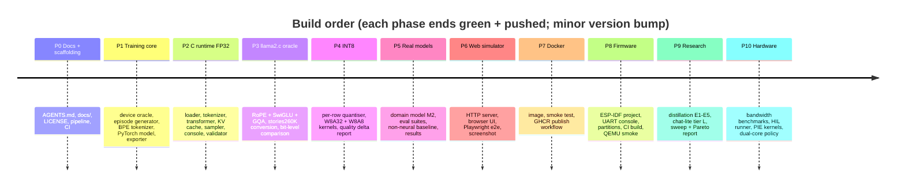
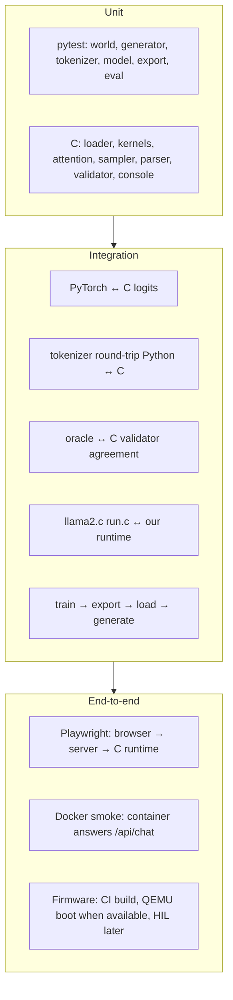
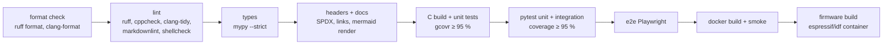

# 06 — Implementation plan: a local, ESP32-runnable tiny LLM

> **Status:** phases P0–P9 are implemented; P10 waits for the board. The item-by-item
> account against the vision is [09-vision-status.md](09-vision-status.md).

The plan turns [`vision.md`](../vision.md) into phases that each end in a green,
pushed, versioned state. Hardware is not attached yet, so every phase is split into what
we can **finish and verify on the host now** and what **waits for the board**. Nothing
that waits for the board blocks the product from working locally.

## 1. Phases at a glance

```mermaid
gantt
    title Relative schedule (agent working hours, not calendar)
    dateFormat  HH:mm
    axisFormat  %H:%M
    section Foundation
    P0 docs + scaffolding       :p0, 00:00, 90m
    section Host product
    P1 training core            :p1, after p0, 90m
    P2 C runtime FP32           :p2, after p1, 120m
    P3 llama2.c oracle          :p3, after p2, 45m
    P4 INT8                     :p4, after p3, 60m
    P5 real models + eval       :p5, after p4, 90m
    P6 web simulator + e2e      :p6, after p5, 60m
    P7 docker + ghcr            :p7, after p6, 30m
    section Embedded
    P8 firmware + CI build      :p8, after p7, 60m
    section Research
    P9 distillation + sweep     :p9, after p8, 120m
    section Needs board
    P10 hardware bring-up       :crit, p10, after p9, 120m
```

## 2. Phase details and exit criteria

### P0 — Docs and scaffolding

- `AGENTS.md`, `docs/01…07`, `README.md` with badges, `LICENSE` (GPLv3),
  `THIRD_PARTY_NOTICES.md`, SPDX headers.
- `localPipeline.sh` + `scripts/` (documented), GitHub Actions running the same script.
- **Exit:** pipeline green locally and on GitHub; Mermaid diagrams render.

### P1 — Training core (vision M5 foundations, §7, §9, §14, §29)

- `training/world/`: greenhouse device world — state, actions, rules, diagnoses
  (the **oracle**), mirrored by the C validator.
- `training/data/`: episode generator — single-turn, multi-turn with references,
  clarification, unsupported/out-of-range, diagnostics; train / validation /
  held-out-template / robustness splits; dataset manifest with hashes.
- `training/tokenizer/`: deterministic byte-level BPE trainer + encoder, special tokens.
- `training/model.py`: PyTorch decoder (RMSNorm, MHA/GQA/MQA, GELU or SwiGLU, learned or
  RoPE positions, tied embeddings).
- `training/train.py`: AdamW, warmup + cosine, seed, run manifest (git rev, tokenizer
  hash, dataset hash, config, metrics).
- `training/export.py`: `.tllm` writer + `manifest.json`; `tools/inspect_model.py`.
- `tools/estimate.py`: the parameter/bandwidth estimator behind
  [01-feasibility.md](01-feasibility.md).
- **Exit:** a tiny model trains on CPU in the test suite and exports a valid file.

### P2 — C runtime FP32 (vision M2, O1)

- `runtime/`: everything in [05-architecture.md](05-architecture.md) §2–§7.
- `tinyllm-cli` REPL and `libtinyllm.so` for ctypes.
- C unit tests (own tiny test harness, no external deps), coverage via gcovr ≥ 95 %.
- Integration tests: Python ↔ C logits for fixed prompts within `1e-4`, tokenizer
  round-trip fixtures, validator agreement between Python oracle and C on random cases.
- Zero-allocation assertion inside `tllm_generate()`.
- **Exit:** "Python, desktop C … agree numerically within defined tolerance."

### P3 — llama2.c as permanent oracle (vision M1, research item 1)

- Runtime supports RoPE, SwiGLU, GQA, and llama2.c's score-based tokenizer.
- `tools/convert_llama2c.py` converts MIT-licensed `stories260K` into `.tllm`.
- Test builds upstream `run.c` (MIT, vendored with notice in `third_party/llama2c/`) and
  compares greedy output token-by-token with our runtime.
- **Exit:** identical greedy continuations for the fixed prompt set.

### P4 — INT8 (vision M4, O3–O4, §11)

- Per-row symmetric INT8 quantiser (Python) + calibration report.
- C paths W8A32 and W8A8 (int32 accumulation), selectable per model.
- Report: validation loss / action accuracy FP32 vs INT8, bytes per token.
- **Exit:** INT8 quality loss within agreed budget (≤ 1 pp action accuracy); Python INT8
  simulation matches C INT8 exactly on logits argmax for the fixture set.

### P5 — Real models and evaluation (vision M3, M6, M7, §19)

- Train the tier-M2 domain assistant on the GPU; commit the INT8 `.tllm` (~0.8 MB) under
  `models/` with its manifest.
- Evaluation suites: in-distribution, held-out templates, robustness (typos, synonyms,
  politeness noise, word order), multi-turn reference resolution, unsupported/unsafe.
- Metrics: exact action accuracy, parameter accuracy, clarification accuracy,
  unsupported accuracy, reference resolution, hallucinated entity rate, length
  violations, malformed-output rate, perplexity; **non-neural keyword baseline** for
  falsifiability.
- Optional TinyStories model (tier M) for the "real transformer" demo.
- **Exit:** results table in `docs/results/`; target ≥ 95 % on the in-distribution suite.

### P6 — Web simulator (usable product on any PC)

- `web/`: stdlib HTTP server + static UI (dashboard, chat, action card, timings).
- Playwright e2e tests; `scripts/screenshot.sh` produces the README screenshot.
- **Exit:** e2e green; screenshot committed.

### P7 — Docker

- Multi-stage `Dockerfile` (build runtime → slim Python runtime image), non-root user,
  healthcheck; `scripts/docker_smoke.sh`.
- `.github/workflows/docker.yml`: build on every push, publish to
  `ghcr.io/marcelpetrick/esp32-tiny-llm` on `main` with `latest` + version tags.
- **Exit:** image runs, smoke test passes locally and in CI, package visible on GHCR.

### P8 — Firmware (vision M0/M2 on-device parts, §12, §13)

- `firmware/`: ESP-IDF project; `components/tinyllm` wraps `runtime/` sources (no copy);
  console task + pinned inference task; model partition; `sdkconfig.defaults`.
- Boot self-test: PSRAM size/mode, model CRC, arena placement report.
- Microbenchmarks ready for hardware: SRAM/PSRAM/flash read bandwidth, dot/GEMV.
- `tools/serial_runner.py`: sends the benchmark suite over serial, captures `@@` lines,
  writes the vision §25 benchmark matrix.
- CI builds the firmware in the official `espressif/idf` container; QEMU smoke test if
  the ESP32-S3 QEMU target supports our configuration.
- **Exit:** firmware builds reproducibly in CI; flashing instructions documented.

### P9 — Research branches (vision M6, M8, §24–25)

- Teacher paraphrase generation via local Ollama (Apache-2.0/MIT teachers only).
- Experiments E1–E5 from [04-distillation.md](04-distillation.md).
- Chat-lite tier L model.
- `tools/sweep.py`: layers × width × vocab × context × MHA/MQA × FFN × dtype; host quality
  plus estimated device speed → Pareto plot in `docs/results/`.

### P10 — Hardware bring-up (needs the board)

- Flash, run self-test, fill the benchmark matrix with **measured** values.
- Replace hot kernels with ESP-DSP/ESP-NN/PIE versions where they measurably win.
- Dual-core policy by arithmetic intensity (research item 3); PSRAM 80 vs 120 MHz.
- HIL job: flash → fixed prompt suite → thresholds (20 % perf regression fails).

## 3. Test strategy

## 4. Pipeline and CI

GitHub Actions runs `./localPipeline.sh` (the same stages), then a separate workflow
publishes the Docker image to GHCR. Stages that need tools not present locally (e.g. the
ESP-IDF container offline) fail loudly rather than being skipped silently.

## 5. Risk register

| Risk | Likelihood | Impact | Mitigation |
|---|---|---|---|
| Tiny model can't reach 95 % on the domain suite | medium | high | better data (oracle + paraphrases), TA distillation, tier L fallback |
| Model memorises templates | high | medium | held-out-template suite, teacher paraphrases, robustness suite |
| INT8 degrades quality | low | medium | per-row scales, keep norms/logits fp32, QAT |
| PSRAM slower than assumed | medium | medium | smaller vocab, INT8/Q4, SRAM staging of hot layers |
| QEMU lacks ESP32-S3 features we use | medium | low | CI build only; HIL once the board arrives |
| Licence problem with reused data/code | low | high | [licence matrix](04-distillation.md), `THIRD_PARTY_NOTICES.md`, no unlicensed code |
| GPU/teacher unavailable in CI | certain | low | CI uses committed artefacts; generation is an offline step |

## 6. Vision traceability

Status is updated as phases land. `host` = verified on the desktop/CI; `board` = needs
hardware.

| Vision item | Phase | Verification |
|---|---|---|
| §2 real transformer components | P2 | unit + integration tests (host) |
| §6 architecture 4×128, RMSNorm, tied, learned pos | P1/P2 | model header + tests |
| §6 variants: RoPE, MQA/GQA, SwiGLU | P3/P9 | runtime flags + sweep |
| §7 1K/2K BPE tokenizer with control tokens, C/Python round-trip | P1/P2 | round-trip fixtures |
| §8 scratch vs pretrained vs distilled | P9 | E1–E5 report |
| §9 corpus stages 1–5 | P1/P5 | generator + manifest |
| §10 language + structured action, strict parser, validator | P1/P2 | parser/validator tests |
| §11 FP32 → INT8 (→ INT4 later) | P4 (INT4 in P9) | quality delta report |
| §12–13 ESP-IDF firmware structure | P8 | CI build |
| §14 versioned binary format, CRC, manifest | P1/P2 | loader rejection tests |
| §15 inference loop with KV cache | P2 | tests |
| §16 memory placement | P8/P10 | arena report (host), heap caps (board) |
| §17 latency buckets, prefill vs decode | P2/P10 | profiler (host), measured (board) |
| §18 O0–O2 | P1–P3 | tests |
| §18 O3–O9 | P4, P10 | host now, board later |
| §19 quality evaluation + robustness | P5 | eval suites |
| §19 HIL evaluation | P8/P10 | serial runner ready; run needs board |
| §20 safety boundaries | P2 | validator tests |
| §21 M0–M8 | all | this table |
| §25 benchmark matrix | P8/P10 | template + runner |
| §29 reproducible training, static memory, stop conditions, observability commands | P1/P2 | manifests, tests |
