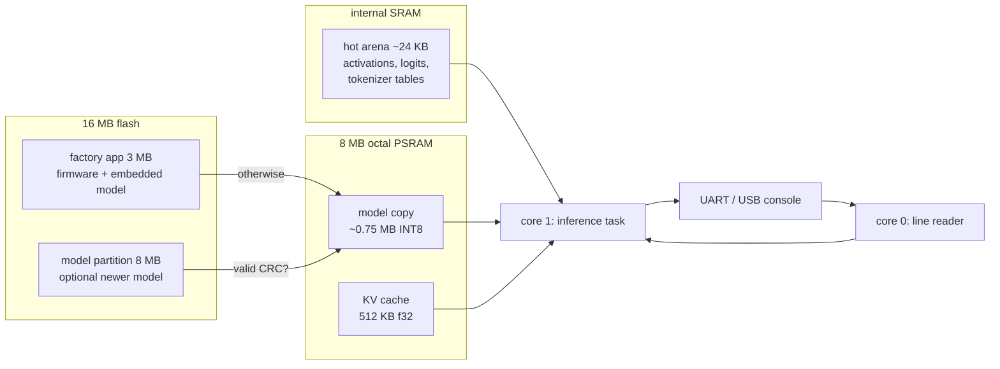

# 08 — Firmware: building, flashing, and bringing up the ESP32-S3

The firmware in [`firmware/`](../firmware) runs the same C runtime as the desktop CLI, the
web simulator and the tests (the component compiles `runtime/src` directly — no copies).

## 1. What runs on the chip



- **Model selection:** a valid model in the `model` partition wins; otherwise the model
  embedded in the app (`models/greenhouse-m-int8.tllm`) is used. Both are CRC-checked by
  `tllm_model_load()`; an incompatible or corrupt model is never loaded.
- **Memory placement** (vision §16): the model is copied to PSRAM (weights are re-read every
  token and flash XIP is slower), the KV cache lives in PSRAM, hot vectors in internal SRAM.
  Without PSRAM the firmware still boots: the model runs from flash XIP and the KV cache is
  INT8 in internal SRAM.
- **Scheduling:** the serial reader runs on core 0, inference is pinned to core 1; a
  per-token hook yields every 200 ms so the task watchdog stays enabled (vision §29).
- **Authority:** the model only proposes actions; `tllm_device_validate()` decides. On a
  real product only that validated path would touch GPIOs.

## 2. Build

No local ESP-IDF needed — the pinned official container is used:

```bash
scripts/firmware_build.sh build            # -> build/firmware/esp32_tiny_llm.bin (~1 MB)
scripts/firmware_qemu.sh                   # boots it in QEMU and chats over the console
```

With a local ESP-IDF v5.5 installation instead:

```bash
cd firmware && idf.py set-target esp32s3 && idf.py build
```

Configuration lives in [`firmware/sdkconfig.defaults`](../firmware/sdkconfig.defaults):
240 MHz, octal PSRAM @ 80 MHz, 64 KB data cache, `-O2`, task watchdog enabled, Bluetooth
off. The partition table is [`firmware/partitions.csv`](../firmware/partitions.csv)
(development layout from vision §29: one large app, one 8 MB model partition).

## 3. Flash and talk to it (needs the board)

```bash
cd firmware
idf.py -p /dev/ttyACM0 flash monitor       # firmware incl. embedded model
# optional: ship a different model without rebuilding the firmware
parttool.py -p /dev/ttyACM0 write_partition --partition-name model --input ../models/greenhouse-m-int8.tllm
```

The console speaks exactly the protocol of `tinyllm-cli` (see
[05-architecture.md](05-architecture.md) §7): plain lines are chat turns, `/help` lists the
commands, every response ends with an `@@{json}` line. Board-only commands:

| Command | Measures |
|---|---|
| `/bandwidth` | sequential read bandwidth of internal SRAM, PSRAM, and flash XIP (MB/s) |
| `/gemv` | GEMV throughput of the first MLP matrix (MMAC/s) with float and int8 activations |
| `/memory` | arena sizes plus live `heap_caps` statistics (internal/PSRAM free and minimum) |
| `/benchmark <case>` | prefill/decode tok/s, first-token latency, mean/p95 token latency, stage profile |

## 4. Hardware-in-the-loop benchmark

```bash
python -m tools.serial_runner --port /dev/ttyACM0 --board "ESP32-S3-DevKitC-1 N16R8" \
    --out docs/results/benchmark-esp32s3.md --json docs/results/benchmark-esp32s3.json
```

The runner collects the boot report, model info, memory, `/bandwidth`, `/gemv`, and four
benchmark cases and renders the benchmark matrix of vision §25. Without a board,
`--host-model models/greenhouse-m-int8.tllm` runs the same suite on the PC (clearly labelled
as a dry run).

## 5. Bring-up checklist (phase P10 — waiting for the board)

1. `idf.py flash monitor`: the boot line must report `PSRAM 8 MB octal @ 80 MHz` and
   `copied to PSRAM`.
2. `/bandwidth` → replace the 45 MB/s estimate in [01-feasibility.md](01-feasibility.md)
   with the measured PSRAM figure; `/gemv` → measured MAC rate.
3. Run the serial runner; commit `docs/results/benchmark-esp32s3.md` (measured).
4. Compare decode tok/s with the estimate (shipped model = tier M2: 26–48 tok/s); if far below, profile
   with `/profile on` and optimise the dominant stage first (vision §18 O4–O8: ESP-DSP /
   ESP-NN dot products, PIE INT8 GEMV, dual-core only where it measurably wins).
5. Try `CONFIG_SPIRAM_SPEED_120M` where the module supports it (research item 20).
6. Add the HIL job to CI with a self-hosted runner attached to the board (20 % regression
   threshold, vision §29).

## 6. QEMU caveats

Espressif's QEMU (`esp32s3` machine) boots the firmware and runs real inference, which is a
strong smoke test of the build, the model embedding, CRC checks, the console and the
no-PSRAM fallback. It does not emulate octal PSRAM or timing: tok/s printed under QEMU is
**not** a performance number.
