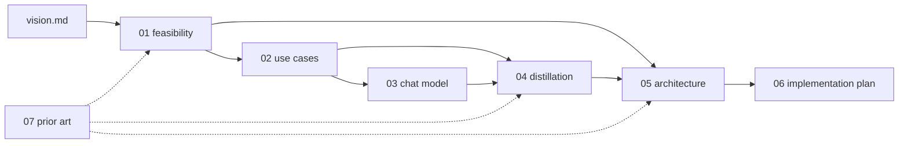

# Documentation

Start with the [project vision](../vision.md); these pages turn it into a feasibility
study, research directions, a concrete architecture, and a build plan. Rules for AI agents
working in this repo are in [AGENTS.md](../AGENTS.md).

| # | Page | Answers |
|---|---|---|
| 01 | [Feasibility](01-feasibility.md) | What fits on an ESP32-S3, how fast, and why memory bandwidth decides |
| 02 | [Use cases](02-use-cases.md) | What transformers can usefully do on this MCU; the chosen product |
| 03 | [Toward a real chat model](03-chat-model.md) | How far toward "real chat" we can push, and at what cost |
| 04 | [Distillation](04-distillation.md) | Learning from larger LLMs; teachers, licences, experiments |
| 05 | [Architecture](05-architecture.md) | Runtime, file format, tokenizer, safety boundary, firmware, web |
| 06 | [Implementation plan](06-implementation-plan.md) | Phases, exit criteria, tests, CI, risks, vision traceability |
| 07 | [Prior art](07-prior-art.md) | Who did what before us, licences, and how we use it |
| — | [Results: tier M](results/greenhouse-m.md) | Measured quality of the shipped model, FP32 vs INT8, effect of distillation |

