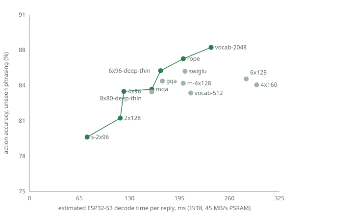

# Results: architecture and vocabulary sweep (vision M8)

14 variants, identical data and 2500 training steps each, INT8, evaluated through the C
runtime on unseen phrasing (held-out frames + teacher paraphrases, 1000 samples each).
Device time per reply is the bandwidth **estimate** (45 MB/s PSRAM) until measured.
Reproduce: `python -m tools.sweep --python .venv-gpu/bin/python`.

| Variant | Params | INT8 weights | Est. tok/s | Tokens/reply | Est. ms/reply | Held-out | Teacher paraphrases | Mean | Pareto |
|---|---:|---:|---:|---:|---:|---:|---:|---:|:---:|
| vocab-2048 | 0.80 M | 0.79 MB | 53 | 12.5 | 236 | 89.3 % | 86.5 % | 87.9 % | ● |
| rope | 0.66 M | 0.66 MB | 62 | 12.5 | 200 | 89.3 % | 84.4 % | 86.9 % | ● |
| 6x96-deep-thin | 0.55 M | 0.54 MB | 73 | 12.5 | 171 | 88.5 % | 83.0 % | 85.8 % | ● |
| swiglu | 0.68 M | 0.66 MB | 62 | 12.5 | 203 | 88.3 % | 83.1 % | 85.7 % |  |
| 6x128 | 0.94 M | 0.92 MB | 44 | 12.5 | 282 | 87.7 % | 82.3 % | 85.0 % |  |
| gqa | 0.61 M | 0.59 MB | 72 | 12.5 | 173 | 86.7 % | 82.9 % | 84.8 % |  |
| m-4x128 | 0.67 M | 0.66 MB | 62 | 12.5 | 200 | 87.4 % | 81.8 % | 84.6 % |  |
| 4x160 | 1.00 M | 0.98 MB | 42 | 12.5 | 296 | 86.0 % | 82.9 % | 84.5 % |  |
| mqa | 0.57 M | 0.56 MB | 78 | 12.5 | 159 | 86.8 % | 81.3 % | 84.0 % | ● |
| 4x96 | 0.41 M | 0.39 MB | 102 | 12.5 | 123 | 86.3 % | 81.4 % | 83.9 % | ● |
| 8x80-deep-thin | 0.50 M | 0.49 MB | 78 | 12.5 | 159 | 85.8 % | 81.8 % | 83.8 % |  |
| vocab-512 | 0.61 M | 0.59 MB | 69 | 14.4 | 210 | 86.0 % | 81.4 % | 83.7 % |  |
| 2x128 | 0.41 M | 0.39 MB | 106 | 12.5 | 118 | 84.1 % | 78.7 % | 81.4 % | ● |
| s-2x96 | 0.26 M | 0.25 MB | 166 | 12.5 | 75 | 80.9 % | 78.4 % | 79.7 % | ● |

## Findings

- Below ~0.4 M parameters quality drops (`s-2x96` 79.7 %, `2x128` 81.4 %); above ~0.7 M
  it does not improve (`6x128`, `4x160`) — consistent with the tier-L result.
- **RoPE** is the cheapest win: +2.3 points over learned positions at identical cost.
- **2048-token vocabulary** is the best variant (+3.3 points) for 20 % more bytes;
  512 tokens is worse and needs 15 % more tokens per reply.
- Deep-and-thin `6x96` matches the baseline with 17 % fewer bytes; MQA saves time for
  ~0.6 points.
- Single short runs: differences below ~1 point are within noise.

**Next model candidate:** 4×128 + RoPE + 2048 vocabulary, trained for the full budget.
