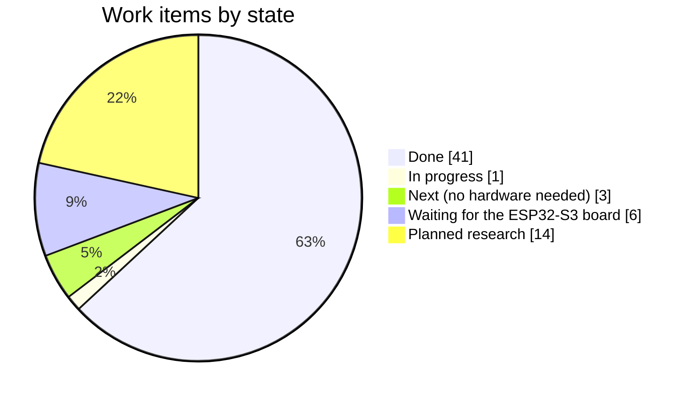
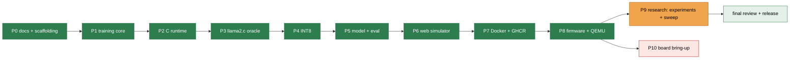

# Plan and status

The living plan of this repository: what is done, what is in progress, what is left, and
what waits for hardware. The phase design is in
[docs/06-implementation-plan.md](docs/06-implementation-plan.md); the item-by-item check
against the vision will be `docs/09-vision-status.md` (committed with the sweep results).

**Rule** ([AGENTS.md](AGENTS.md) §2.4): every commit updates this file. `scripts/ship.sh`
refreshes the *Current state* block automatically; edit the tables by hand whenever a
work item changes state.

## Status at a glance

## Done

| Area | Result |
|---|---|
| Docs | vision study 01–09, AGENTS.md, prior art with licences, results pages |
| Pipeline | `localPipeline.sh` (14 stages incl. e2e, Docker, firmware/QEMU), mirrored by GitHub Actions |
| Training | device oracle, dialogue generator, teacher distillation (Qwen3.5-4B), BPE, PyTorch model, KD, pretraining data |
| Runtime | C99, f32/W8A32/W8A8, int8 KV, RoPE, SwiGLU, GQA/MQA, zero heap after init, 99 % C coverage |
| Verification | Python ↔ C logits within 1e-4; identical output to upstream llama2.c `run.c`; chip tokenizes like Python (QEMU) |
| Model | 673 k params, 732 KiB INT8; 99 % in-distribution, 88 % unseen phrasing, 99.5 % multi-turn, 99.6 % safety |
| Experiments | E1–E4 (vision M6): teacher phrasing is the decisive lever; tier L gives no gain |
| Product | web simulator, Docker image on GHCR, firmware with embedded model and board benchmarks |
| Review | `/reviewBranch` findings 1–4 fixed (history hygiene, cache key, arena ownership, render guard) |
| Repository page | `/githubAbout`: About text and 10 topics applied, each claim traced to a file |
| Process | `plan.md` + AGENTS.md rule; `ship.sh` refreshes it on every commit (never stashes it) |

## In progress

| Item | State |
|---|---|
| Architecture + vocabulary sweep (vision M8) | training on the GPU (14 variants), then `docs/results/sweep.md` + Pareto SVG |

## Next (no hardware needed)

```mermaid
gantt
    title Remaining work (agent hours)
    dateFormat HH:mm
    axisFormat %H:%M
    section Research
    finish sweep, write sweep.md       :a1, 00:00, 60m
    section Docs
    commit 09 vision status            :a2, after a1, 10m
    retake README screenshots          :a3, after a1, 10m
    section Release
    final vision check, CI + GHCR pull :a5, after a2, 20m
```

| Item | Detail |
|---|---|
| Sweep results page | table + Pareto chart from `tools.sweep --report` |
| Vision status page | `docs/09-vision-status.md` (links the sweep page) |
| Screenshots | retake once the GPU is idle (host timings) |
| Release checks | full pipeline, CI green, `docker pull` + run, clean tree |

## Waiting for the ESP32-S3 board (phase P10)

| Item | How |
|---|---|
| measured PSRAM/SRAM/flash bandwidth | `/bandwidth`, replaces the 45 MB/s estimate |
| measured tok/s, latency, memory | `tools/serial_runner.py` → `docs/results/benchmark-esp32s3.md` |
| optimised kernels | ESP-DSP / ESP-NN / PIE INT8 GEMV where they measurably win |
| dual-core policy | split rows only above the measured crossover |
| PSRAM 120 MHz trial | module permitting |
| HIL CI | self-hosted runner with the board, 20 % regression threshold |

## Planned research (after v1, vision §24–25)

INT4 / activation-aware Q4 · ternary (BitNet) student · LUT-based low-bit GEMV ·
per-layer embeddings in flash · factorised embeddings / layer sharing · on-policy
distillation (E5) · joint tokenizer for a fair language-prior test · chat-lite corpus
(persona, small talk) · retrieval of device facts · sensor-token encoder · on-device
adaptation · energy per token · Espressif operators as oracle · hybrid recurrent/local
attention.

## Current state

<!-- ship:begin -->

| Field | Value |
|---|---|
| Version | `0.6.18` |
| Updated | 2026-09-28 14:29 UTC |
| This commit | docs(plan): record the GitHub About text and topics |

Recent commits:

- `5867c17` fix(tools): never stash plan.md in ship.sh
- `f3abae9` docs: add plan.md status with charts and update it on every commit
- `da0f102` fix(data): include the teacher model in the paraphrase cache key
- `39ddb45` fix(runtime): keep only well-formed replies in the conversation history
- `0597e39` docs(results): add the M6 distillation experiment comparison
- `61a240d` fix(tools): skip model manifests in the experiment report
- `26d84cf` docs: record the tier-L capacity result and the full console command set
- `d43f52d` fix(web): send a strict Content-Security-Policy

<!-- ship:end -->
