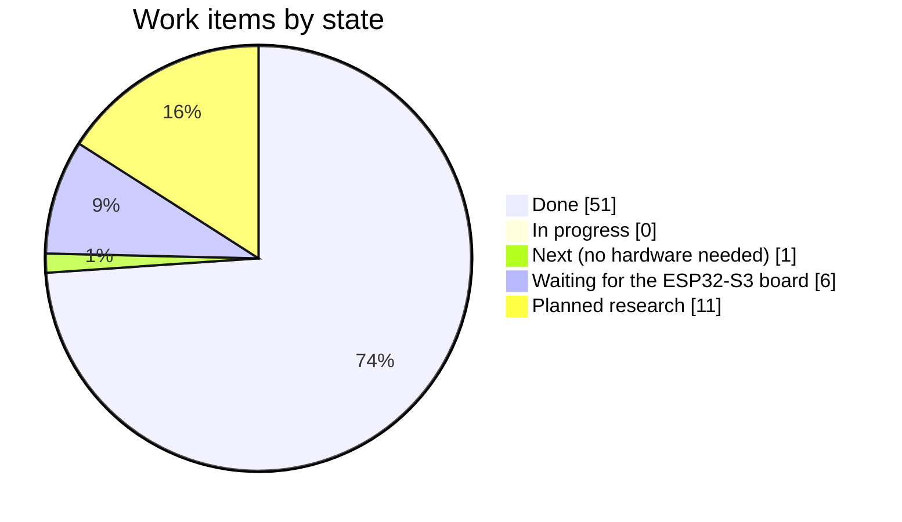
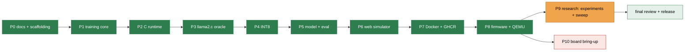

# Plan and status

The living plan of this repository: what is done, what is in progress, what is left, and
what waits for hardware. The phase design is in
[docs/06-implementation-plan.md](docs/06-implementation-plan.md); the item-by-item check
against the vision is [docs/09-vision-status.md](docs/09-vision-status.md).

**Rule** ([AGENTS.md](AGENTS.md) §2.4): every commit updates this file. `scripts/ship.sh`
refreshes the *Current state* block automatically; edit the tables by hand whenever a
work item changes state.

## Status at a glance

## Done

| Area | Result |
|---|---|
| Docs | vision study 01–09, AGENTS.md, prior art with licences, results pages |
| Pipeline | `localPipeline.sh` (14 stages incl. e2e, Docker, firmware/QEMU), mirrored by GitHub Actions |
| Training | device oracle, dialogue generator, teacher distillation (Qwen3.5-4B), BPE, PyTorch model, KD, pretraining data |
| Runtime | C99, f32/W8A32/W8A8, int8 KV, RoPE, SwiGLU, GQA/MQA, zero heap after init, 99 % C coverage |
| Verification | Python ↔ C logits within 1e-4; identical output to upstream llama2.c `run.c`; chip tokenizes like Python (QEMU) |
| Model | v3: 788 k params, 804 KiB INT8 (RoPE, 2048 vocab, picked by the sweep); 99 % in-distribution, 88–89 % unseen phrasing, 99.7 % multi-turn, 100 % safety |
| Experiments | E1–E5 (vision M6): teacher phrasing is the decisive lever; tier L gives no gain; on-policy correction (E5) fixes fallbacks but costs safety, so v3 stays |
| Sweep | 14 variants (vision M8), label-collision-free chart, [Pareto chart](docs/results/sweep.md): RoPE and 2048 vocab are the best levers |
| Product | web simulator (README screenshots at idle host timings), Docker image on GHCR, firmware with embedded model and board benchmarks |
| Dual-core GEMV | row-split executor (core 0 worker), `/parallel N`, identical results in QEMU |
| INT4 | Q4 lossless at 0.8 M and 2.3 M params; bigger Q4 model not better (data-bound). Q4 group-wise format + C kernels (W4A32/W4A8), exact Python↔C parity; shipped v3 as 446 KiB Q4 with no quality loss |
| Retrieval (§24 D) | fact table in Python + C (parity-tested), `<F>` injection; facts model copies unseen facts 99.5 % exact |
| Review | `/reviewBranch` findings 1–4 fixed (history hygiene, cache key, arena ownership, render guard) |
| Repository page | `/githubAbout`: About text and 10 topics applied, each claim traced to a file |
| Process | `plan.md` + AGENTS.md rule; `ship.sh` refreshes it on every commit (never stashes it) |

## In progress

| Item | State |
|---|---|

## Next (no hardware needed)

```mermaid
gantt
    title Remaining work (agent hours)
    dateFormat HH:mm
    axisFormat %H:%M
    section Research
    chat-lite small talk (§24, "real chat" direction) :a1, 00:00, 60m
    section Release
    final vision check, CI + GHCR pull :a5, after a1, 20m
```

| Item | Detail |
|---|---|
| Release checks | full pipeline, CI green, `docker pull` + run, clean tree |

## Waiting for the ESP32-S3 board (phase P10)

| Item | How |
|---|---|
| measured PSRAM/SRAM/flash bandwidth | `/bandwidth`, replaces the 45 MB/s estimate |
| measured tok/s, latency, memory | `tools/serial_runner.py` → `docs/results/benchmark-esp32s3.md` |
| optimised kernels | ESP-DSP / ESP-NN / PIE INT8 GEMV where they measurably win |
| dual-core policy | executor done (`/parallel N`); measure the crossover and set the default |
| PSRAM 120 MHz trial | module permitting |
| HIL CI | self-hosted runner with the board, 20 % regression threshold |

## Planned research (after v1, vision §24–25)

ternary (BitNet) student · LUT-based low-bit GEMV ·
per-layer embeddings in flash · factorised embeddings / layer sharing ·
joint tokenizer for a fair language-prior test · chat-lite corpus
(persona, small talk) · sensor-token encoder · on-device
adaptation · energy per token · Espressif operators as oracle · hybrid recurrent/local
attention.

## Current state

<!-- ship:begin -->

| Field | Value |
|---|---|
| Version | `0.10.2` |
| Updated | 2026-09-29 16:50 UTC |
| This commit | docs(results): measure the dense Q4 upper boundary with tier L |

Recent commits:

- `8aaf550` feat(docker): offer the facts model in the web simulator
- `a9ad2a1` feat(model): ship a facts model that answers from retrieved device facts
- `ec3588c` docs(results): report on-policy correction (E5); v3 stays the product
- `cbdff81` feat(training): mine the student's mistakes for on-policy correction (E5)
- `80fad25` feat(runtime): retrieve device facts and inject them for facts-enabled models
- `5062eb7` feat(firmware): split large GEMVs across both ESP32-S3 cores on demand
- `f98074f` feat(runtime): add group-wise INT4 (Q4) weights and ship a Q4 model
- `6446702` feat(model): ship v3 (RoPE, 2048-token vocabulary) chosen by the sweep

<!-- ship:end -->
